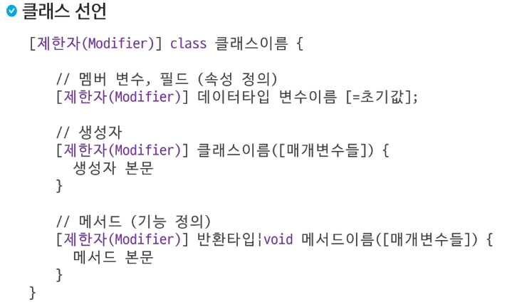
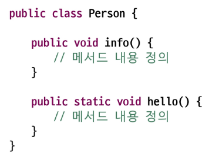

# Java
## 클래스와 객체

### 함수
- 반복적으로 사용되는 코드를 재사용 가능하게 만들어 *가독성*과 *유지 보수성*을 향상 시킴

```java
public static void 교육() {
    ...
}
```
```java
public static boolean 교육() {
    ...
    Random random = new Random();
    return random.nextBoolean();
}
```

- 특정 작업을 수행하는 코드 블록에 이름을 붙인 것
- 함수의 구성 요소: 반환타입(또는 void), 함수이름, 매개변수, 함수 내용
- return 구문은 반환 타입이 void인 경우 생략이 가능

```java

```

---
### 클래스
```java
/*
    int size = 2;
    String[] names = new String[size];
    int[] names = new int[size];
    String[] hobbies = new String[size];

    names[0] = "Yang"
    names[1] = "Hong"

    ages[0] = 45
    ages[1] = 25

    hobbies[0] = "Youtube"
    hobbies[0] = "Golf"
*/
    // 위를 클래스로 만듦

    public class personTest {
        public static void main(String[] args) {
            Person yang = new Person();
            yang.name = "Yang";
            yang.age = 45;
            yang.hobby = "Youtube";

            Person hong = new Person();
            hong.name = "Hong";
            hong.age = 25;
            hong.hobby = "Golf";
        }

        public static void info(String name, int age, String hobby) {
            System.out.printf("이름: %s, 나이: %d, 취미: %s". name, age, hobby);
        }
    }
```
```java
public class Person {
    String name;
    int age;
    String hobby;

    void info() {
        System.out.printf("이름: %s, 나이: %d, 취미: %s". name, age, hobby);
    }
}
```

- 관련 있는 변수와 함수를 묶어서 만든 사용자 정의 자료형
- 객체를 생성하기 위한 설계도
- 클래스를 통해 생성된 객체 -> 인스턴스

#### 클래스 구성 요소
- 필드
    - 클래스에 선언된 변수
- 메서드
    - 특정 동작을 수행하는 코드 블록
    - 입력(매개변수)를 이용하여 처리하고 결과를 반환
    - 오버로딩 가능
- 생성자
    - 특별한 매서드

#### 클래스 선언


#### 객체(인스턴스) 생성
- 클래스이름 객체이름 = new 클래스이름([생성자매개변수들])

#### 객체 멤버 접근
- . 연산자를 활용
- 필드 값 접근
    - 객체이름.멤버변수이름
- 메서드 호출
    - 객체이름.멤버메서드이름([매개변수들])

#### 메서드
- 객체가 할 수 있는 행동을 정의
- 어떤 작업을 수행하는 명령문의 잡합에 이름을 붙여 놓은 것
- 메서드의 이름은 소문자로 시작하는 것이 관례

#### 메서드 호출
- 객체를 생성한 후 객체의 멤버 메서드를 호출한다.



```java
Person p = new Person();
p.info();

Person.hello(); // static이 메서드에 선언되어 있을 때는 클래스이름.메서드 이름으로 호출
```

#### 반환타입
- 메서드 선언 시 타입을 지정, 없다면 void 작성
- 반환타입이 void가 아니라면 반드시 해당 타입의 값을 return해야함.

#### 메서드 오버로딩
- 이름이 같고 매개변수가 다른 메서드를 여러 개 정의하는 것
- 파라미터의 개수 또는 순서, 타입이 달라야 할 것


---
### 생성자
- 객체 생성 시 호출되는 특별함 메서드
- 클래스 이름과 같고. 반환 타입이 없음
- new 키워드와 함께 호출하여 객체 생성
- 객체 생성 시 반드시 호출 되어야 함
- 기본 생성자를 자동으로 제공
- 오버로딩 가능
- 생성자의 첫번째 라인으로 this() 생성자를 사용하여 또 다른 생성자를 하나 호출 가능

#### 기본 생성자
- 매개변수가 없는 생성자

#### 매개변수 생성자
- 매개 변수를 받아 객체를 초기화
- 생성자 호출 시 인자를 넘겨주어야 함

#### this.
- 매개변수 이름과 필드 이름이 같을 때, 필드를 구분하기 위해서 사용

#### this()
- 같은 클래스의 다른 생성자를 호출
- 반드시 생성자의 첫번째 줄에 위치

--- 
### 객체지향 프로그래밍
- 객체: 의사나 행위가 미치는 대상, 작요의 대상 / 세상의 모든 사물, 개념
- 객체(Object): 데이터와 관련된 알고리즘을 하나의 단위로 묶어놓은 것
- 객체 모델링: 현실세계의 객체를 SW 객체로 설계하는 것

#### 객체지향 프로그래밍 특징
- 추상화
- 다형성
- 상속
- 캡슐화

#### 장점
- 모듈화
- 재사용성