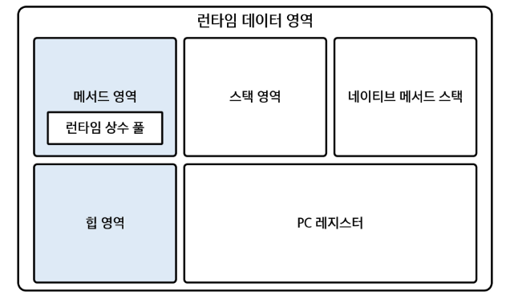
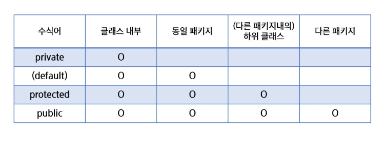

# Java
## 객체배열관리

### JVM 메모리 구조
#### JVM
- 자바 프로그램에 실행되는 환경 제공
- 메모리를 관리하기 위해 여러 영역으로 나뉨
    - 메서드 영역
    - 힙 영역
    - 스택 영역
    - PC 레지스터
    - 네이티브 매서드 스택
- GC: JVM은 가비지 컬렉터를 통해 자동으로 메모리 관리

#### JVM 메모리 구조

- 파란색: 공용, 흰색: 독립

#### 메서드 영역
- 클래스 정보를 저장(클래스 영역이라고도 부름)
- 정적 변수, 상수, 메서드, 클래스 정보 등이 저장됨
- 모든 스레드가 공유
- 클래스 로더에 의해 클래스가 로드될 때 저장되는 공간 

#### 힙 영역
- 객체 인스턴스를 저장하는 공간(new Pserson()이 저장된다고 생각)
- GC가 관리하는 영역
- 인스턴스 변수, 배열 등이 해당 영역에 저장
- 어플리케이션이 사용할 수 있는 가장 큰 메모리
- 모든 스레드가 공유

#### 스택 영역
- 지역 변수, 메서드 호출 시 사용되는 값, 연산 결과 등 저장
- 메서드 호출 시 스택 프레임이 생성되며 끝나면 스택 프레임 제거
- 쌓이는 형태
- 스레드마다 생성

#### PC 레지스터
- 현재 실행 중인 메모리의 주소를 저장하는 영역
- 프로그램 실행 흐름을 제어
- 스레드마다 생성

#### 네이티브 메서드 스택
- 네이티브 언어로 작성된 메서드 호출 시 사용하는 메모리 영역
- 스레드마다 생성 

#### 객체 생성과 메모리 할당


---

### static키워드
#### static
- 클래스 수준에서 공유되는 멤버를 정의하는 데 사용
- static 키워드를 작성하면 객체와 무관하게 클래스 자체에 속함(인스턴스와 무관)
- 특정 객체에 속하지 않고 모든 객체가 동일한 static 멤버를 참조
- 클래스의 이름을 통해 직접 호출 가능(권장)
- JVM 영역에 저장

#### static 필드
- 정적 필드는 클래스 수준에서 공유
- 객체마다 값이 다른 인스턴스 필드와는 달리 모든 인스턴스가 공유
- 클래스 이름을 통해 호출하는 것을 권장

#### static 메서드
- 정적 메서드는 클래스 이름을 통해 직접 호출할 수 있는 메서드

#### static 블록
- 클래스 변수를 초기화하기도 하지만, 안에서 특정한 작업 또한 가능

```java
public static void eat() {

}
// 미리 메모리에 저장
```

```java
public static study() {

}
// new 인스턴스를 해야함
```

### 접근제한자
#### 패키지
- 클래스와 인터페이스를 묶는 디렉토리 구조
- 클래스 이름 충돌 방지
- 클래스 파일 첫번째 줄에 package 키워드 사용하여 선언
- .을 이용하여 패키지를 구분

#### import
- 다른 패키지에 있는 클래스를 사용하기 위해선 import 과정이 필요
- 단일 import -> import [풀 패키지명]
- 전체 import -> import [패키지명] *

#### 캡슐화
- 필드와 메서드를 하나의 단위로 묶고, 외부로부터 데이터를 숨기며 안전하게 보호하는 것
- 정보 은닉 -> 내부 데이터를 외부에서 직접 접근하지 못하게 하고 특정 메서드를 통해서만 접근 가능

#### 접근 제한자
- 클래스, 메서드, 변수 등에 대한 접근 범위를 지정
- 캡슐화와 정보은닉을 가능하게 함
- 다른 제한자들과는 달리 접근 제한자는 하나만 작성이 가능

#### 접근 제한자 종류
- public: 모든 위치에서 접근 가능
- protected: 같은 패키지 또는 패키지가 달라도 상속 관계에서 접근 가능
- default: 같은 패키지 안에서만 접근 가능
- private: 같은 클래스 내부에서만 접근 가능



#### getter(접근자), setter(설정자)
- 캡슐화를 구현하는 데 사용되는 메서드
- getter: private 필드 값을 외부에서 읽을 수 있게 함
- setter: private 필드 값을 외부에서 수정할 수 있게 함
- -> 직접 접근이 아닌 안전하게 읽고 쓰는 방식 제공


### 객체배열관리
- 같은 자료형을 연속된 메모리에 할당해서 쓰는 것
- 여러 객체를 하나의 배열로 묶어 관리하는 방식
- 객체 배열의 요소는 객체 참조 값을 저장
- 기본 값은 null로 초기화
- 객체를 추가, 조회, 수정, 삭제할 수 있음(CRUD)
- 싱글턴 패턴을 사용하여 관리할 수 있음

#### 싱글턴 패턴
- 객체를 하나만 생성하도록 보장하는 디자인 패턴
- 객체의 유일성 보장 -> 하나의 인스턴스만 생성

1. 싱글턴 1장: 외부에서 생성하지 못하게 하라
2. 싱글턴 2장: 나는 내가 만들어
3. 싱글턴 3장: 내가 만든 나를 외부에서 쓸 수 있게 오픈
3. 싱글턴 3-1장: 메모리에 올려놓자
4. 실글턴 4장: 너도 메모리에 올라가 있어라!