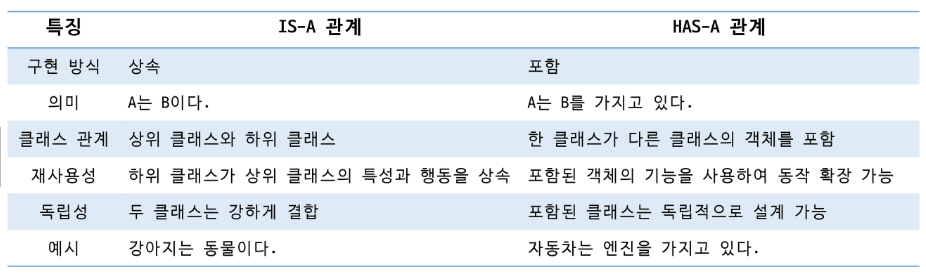

# Java
## 상속

### 상속
- 상위 클래스의 속성과 메서드를 물려받아 확장하여 새로운 자식 클래스를 정의하는 것
- 사람과 학생
    - Student가 Person 클래스의 속성과 메서드를 물려받아 major과 study 메서드를 추가
    - ```public class Student extends Person```

#### 상속의 특징
- 코드 재사용성: 상위 클래스에 정의된 필드, 메서드 사용 가능 / 공통된 기능을 상위 클래스에 정의
- extends 키워드 사용
- 상속을 명시하지 않으면 기본적으로 Object 클래스를 상속받고 있음
- 다중 상속 불가
- 인터페이스를 사용하여 다중 상속과 비슷한 효과를 구현할 수 있음
- is - a 관계
    - A는 B이다
    - 상위 클래스는 하위 클래스의 공통된 특성과 행동을 정의하며, 하위 클래스는 이를 확장하거나 구체화
- has - a 관계
    - A는 B를 가지고 있다
    - 한 클래스가 다른 클래스의 객체를 속성으로 포함하여 구현
- 
- 접근 제한자에 따라 상위 클래스의 멤버에 대한 접근 범위가 결정됨
- 공통된 기능이 정의되어 있는 상위 클래스만 수정하면 하위 클래스는 모두 적용

#### super 키워드
- 상위 클래스의 멤버를 참조하는 데 사용
- this 키워드가 현재 클래스의 멤버를 참조하는데 사용하는 것처럼, super는 상위 클래스와 관련된 작업을 수행할 때 사용
- 상위 클래스 필드 참조: 하위 클래스에서 상위 클래스와 동일한 이름의 필드가 있을 경우, super를 사용하여 필드를 참조
- 상위 클래스 메서드 호출: 하위 클래스에서 상위 클래스의 메서드를 호출하여 기능을 유지하거나 확장할 수 있음
- 상위 클래스 생성자 호출
    - 하위 클래스의 생성자에서 super()를 사용하여 상위 클래스의 생성자를 명시적으로 호출할 수 있음
    - 반드시 첫 줄
    - 명시적으로 작성하지 않으면 컴파일러는 기본 생성자를 호출
    - this()와 같이 사용할 수 없음

#### 메서드 재정의 (Overriding)
- 메서드 이름, 매개변수, 반환 타입이 상위 클래스와 동일해야함
- 접근 제한자는 상위 클래스의 메서드보다 더 넓은 범위로만 변경 가능

---
### Object
#### Object 클래스
- 자바의 가장 최상위 클래스로 모든 클래스의 조상
- 모든 클래스는 직접적으로나 간접적으로나 Object를 상속 받음

1. toString()
2. equals()
3. hashCode()
4. getClass()

---
### fianl 키워드
#### final
- 변경 불가능성을 나타내는 키워드
- 컴파일 타임 안정성을 높이는데 사용
- 변수: 값의 고정성
- 메서드: 재정의 방지
- 클래스: 상속 불가능
- 과도한 사용은 코드의 유연성을 감소 시킴

#### final 변수
- 값이 변경되지 않는 상수를 선언할 때 사용
- 선언과 동시에 초키화 혹은 생성자를 통한 초기화를 해야함
- 참조 변수에 final을 사용하면 참조를 바꿀 수는 없지만, 객체의 내부 상태는 변경 가능

#### final 메서드
- 재정의(Overriding) 금지 -> 하위 클래스에서 재정의할 수 없음

#### final 클래스
- 상속할 수 없는 클래스 정의
- 클래스 자체를 확장할 필요가 없거나, 보안을 강화해야 하는 경우 사용