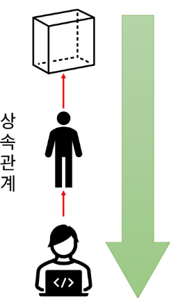

# Java
## 다형성, 추상클래스

### 다형성
- 실제 하나의 객체를 다양한 타입의 참조로 사용할 수 있음
- 다양한 유형의 여러 객체를 하나의 공통된 타입으로 참조
- 상속관계에 있을 때 조상클래스 타입으로 자손 클래스의 객체를 참조할 수 있음
- 참조만 바뀔 뿐 실제 객체 자체는 변함이 없음 (스택영역에서 참조)

#### 장점
- ```코드의 유연성``` -> 상위 클래스 또는 인터페이스 타입으로 다룰 수 있음
- ```코드의 재사용성``` -> 공통 동작을 상위클래스 또는 인터페이스에 정의하여 중복 코드를 제거
- ```확장성``` -> 새로운 클래스 추가 시 기존 코드 없아도 쉽게 확장 가능
- ```유지보수성``` -> 변경 사항이 상위 클래스나 인터페이스를 수정하면 되므로 용이

#### JVM 메모리(힙 영역)
- = new Student();
- super() -> 부모의 기본 생성자를 호출하겠다. </br></br>

- 셋 다 가능
- 메모리에 있더라도 참조하는 변수 타입에 따라 제한

```java
Person p = new Student(); // 가능 (학생은 사람이다.)
Student st = new Person(); // 불가능 
// 참조를 바꾸더라도 실제 메모리에 생성되어있는 인스턴스는 변함이 없다.

p.eat() // '지식을 먹는다'가 나옴
// 참조타입은 Person이지만 Student에서 eat라는 메서드를 재정의 했음
// 따라서 Student의 eat() 메서드가 동작하게 됨.
```

#### 참조변수의 형 변환

- 자손타입 -> 조상타입(묵시적 형변환)
- 형 변환 생략 기능
```java
Student st = new Student();
Person p = st;
```

- 조상타입 -> 자손타입(명시적 형 변환)
- 형 변환 생략 불가능 -> 직접 변환해주어야함

```java
Person p = new Person();
Student st = (Student) p;
st.study(); //java.lang.ClassCastExeption 에러가 남 

----
Person p = new Student();
Student st = (Student)p;
```

#### instanceof 연산자
- 참조변수가 참조하고 있는 인스턴스의 타입을 확인하기 위해서 사용
- 결과를 boolean으로 반환
- true가 반환이 되면 해당 타입으로 형 변환 가능

#### 동적, 정적
- 동적 바인딩 -> 둘다 child 메서드가 나옴
- 정적 -> 각 static 메서드가 나옴

#### 참조변수와 인스턴스 멤버의 관계
- 상속 관계에서 멤버변수가 중복이 되면 참조 변수 타입에 따라 연결이 달라짐
- 메서드가 중복될 때(오버라이딩), 참조 변수의 타입에 상관없이 항상 실제 인스턴스의 자식 클래스 메서드가 호출 -> 동적바인딩
- 클래스 이름으로 메서드 호출 권장 (static 메서드는 참조변수 타입의 영향을 받기 때문)

#### 다형성의 활용
- 다른 타입의 객체를 다루는 배열


---

### 추상클래스
#### 추상클래스 정의
- 조상 클래스에 메서드를 정의하고 각 자손 클래스에서 override 예정
- 사용되지 않는 클래스에 메서드가 필요한가? -> 쓰이지 않는 코드를 지운다면?
- override된 메서드는 자손 클래스에서 반드시 재정의해서 사용되기 때문에 조상의 구현이 무의미
- 메서드의 선언부만 남기고 구현부는 ;(세미콜론)으로 대체
- 구현부가 없으므로 abstract 키워드를 메서드 선언부에 추가
- 객체를 생성할 수 없는 클래스라느 의미로 클래스 선언부에 abstract 추가

#### 추상 클래스 특징
- abstract 클래스는 상속 전용의 클랮스
- 클래스에 구현부가 없는 메서드가 있으므로 객체를 생성할 수 없음
- 상위 클래스 타입으로 자식을 참조할 수는 있음
- 조상 클래스에서 상속 받은 abstract 메서드를 재정의하지 않는 경우 클래스 내부에 abstract 메서드가 있으믏 자식 클래스는 abstract 클래스가 되어야 함.
- 다중 상속 불가

#### 추상 클래스 사용 목적
- 공통적인 설계 강제 -> 미완성의 매서드를 제공함으로써 구현을 강제 시킴
- 코드 재사용성 향상
- 일관성 유지 -> 추상 메서드를 통해 하위 클래스가 동일한 동작을 가지도록 보상 
- 다형성 지원 -> 유연한 설계 가능

- 추상클래스 -> 미완성의 설계도 -> 인스턴스를 생성할 수 없음
- 미완성인 부분을 만들어줄 순 없을까?
- 익명 클래스 문법을 이용하여 1회 한정으로 구현하면 인스턴스를 생성할 수 있다.

#### 클래스와 추상클래스 비교
