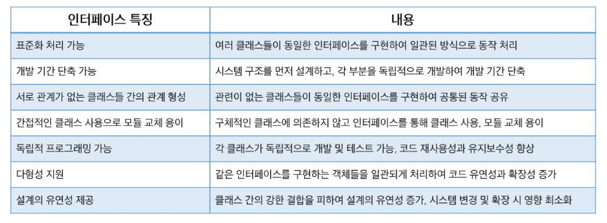
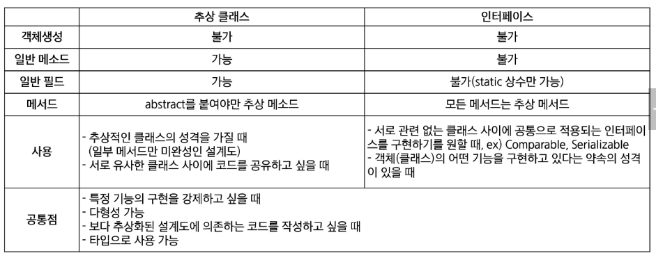
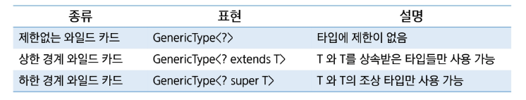

# Java
## 인터페이스, 제네릭

### 인터페이스
- 다양한 분야에서 사용되는 용어
- 두 개체간의 상호작용 방식을 정의하는 경계

- 두 개체가 서로 이해할 수 있는 언어와 규칙을 정의
- 복잡한 내부 동작을 숨기고, 사용자가 단순한 방식으로 접근하도록 도움
- 표준을 정하여 다른 구성 요소들이 같은 규칙을 따르도록 함.

- 완벽히 추상화된 설계도
- 클래스와 유사하게 작성되지만 class 대신 interface 키워드 사용
- 모든 메서드가 추상 메서드
- 인터페이스 내에 선언된 메서드는 public abstract가 기본으로 생략할 수 있음
- 인터페이스 내에 정의된 변수는 자동으로 public static final로 간주되며, 생략할 수 있음

#### 인터페이스의 구현
- 인터페이스는 인스턴스를 생성할 수 없음
- 클래스가 인터페이스를 구현할 경우 implements 키워들을 사용
- 클래스는 여러 인터페이스를 다중 구현 가능
- 클래스는 인터페이스의 추상메서드를 모두 구현해야 객체 생성 가능 -> 모두 구현하지 않으면 추상 클래스로 변경해야 함

#### 인터페이스 상속
- extends 키워드를 이용하여 상속
- 클래스와 달리 인터페이스는 다중 상속이 가능

#### default 메섯드
- 인터페이스에 구현부가 있는 메서드를 작성할 수 있음
- 메서드 앞에 default 라는 키워드를 작성해야 함
- public 접근 제한자를 사용해야 하며 public은 생략 가능
- 클래스에서 인터페이스의 default 메서드를 재정의할 수 있음

#### 정적 메서드
- 인터페이스 내에 선언된 static 메서드는 클래스의 static 메서드와 사용 방법이 동일함
- 인터페이스 이름으로 매서드에 접근하여 사용
- 특정 인터페이스에 관련된 유틸리티 메서드나 헬퍼 메서드를 제공할 수 있음
- static 메서드는 인터페이스를 구현한 클래스에서 상속되거나 재정의할 수 없음

#### private 메서드
- 인터페이스 내부에서만 사용되는 헬퍼 메서드
- 디폴트 메서드, 정적 메서드에서 반복되는 로직 분리 후 작성
- 외부에서 접근하지 못하도록 숨김
- 재사용성 증가
- static 키워드를 사용할 수 있음

#### 인터페이스와 다형성
- 인터페이스를 구현한 클래스로 만든 객체는 해당 인터페이스 타입으로 참조할 수 있음
- 동적 바인딩: 런타임 시점에는 실제 객체의 메서드가 호출

#### 인터페이스의 필요성

#### 추상 클래스와 인터페이스 비교

### 제네릭
- 다양한 데이터 타입을 처리할 수 있는 클래스, 인터페이스, 메서드를 작성하는 기법
- 컴파일 시점에서 데이터 타입을 지정할 수 있음 -> 타입 안정성 제공
- 하나의 코드로 여러 타입에 대해 동작하게 설계 가능 -> 코드 재사용성 증가
- 데이터 타입을 지정하였으므로 불필요한 타입 캐스팅을 제거할 수 있음

#### 제네릭 클래스
- 클래스 정의 시 타입 매개변수를 사용하여 다양한 타입을 처리할 수 있는 클래스
- 타입 매개변수는 <T> 안에 적는다.

#### 제네릭 클래스 선언
- 클래스 또는 인터페이스 선언 시 <>에 타입 파라미터 표시
- 타입 파라미터 -> 특별한 의미의 알파벳 보다는 단순히 임의의 참조형 타입을 말함

#### 제네릭 클래스 객체 생성
- 변수와 생성 쪽의 타입은 반드시 일치해야 함(상속관계에 있어도 마찬가지)
- 추정이 가능한 경우 타입 생략 가능
- 제네릭 타입을 지정하지 않고 생성이 가능하지만 권장 X

#### 제너릭 메서드
- 타입 파라미터를 사용하는 메서드
- 클래스의 타입 파라미터와는 별개로, 메서드 레벨에서 제너릭 타입을 정의하고 사용할 수 있음
- 제너릭 메서드는 메서드의 매개변수나 반환 타입을 타입 파라미터로 지정하여 다양한 타입을 처리
- 제너릭 메서드를 정의하려면 메서드의 반환 타입 앞에 타입 파라미터를 선언
- 메서드를 호출할 때는 타입 파라미터를 생략 가능할 수도 있지만 명시할 수도 있음
- 명시할 때는 메서드명 앞 ,. 연산자 사이에 <타입>을 표시

#### 한정된 타입 매개변수
- 제네릭 클래스를 정의할 때
- 모든 종류의 타입에 대햊서 작성하는 것이 아니라 특정한 종류의 타입에 대해서만 작성하고 싶은 경우
- 구체적인 타입의 제한이 필요할 때 extends 키워드를 사용할 수 있음
- 타입 파라미터를 한정할 때는 하한 경계의 사용이 불가하며, 상한 경계만 사용 가능
- 클래스가 아닌  인터페이스로 제한할 경우도 extends 키워드 사용
- 클래스와 함께 인터페이스 제약 조건을 이용할 경우 &로 연결

#### 와일드 카드
- 제네릭 클래스 인승턴스 변수의 참조 타입을 작성할 때
- 와일드 카드로서 문자 ?를 사용
- 불특정 타입을 나타내기 위해 사용하는 특수한 타입 매개변수
- 제네릭 클래스에 다형성 적용 가능
