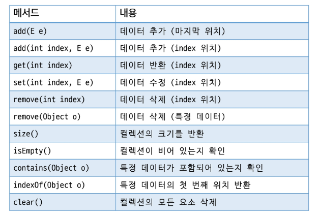
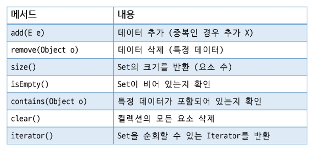
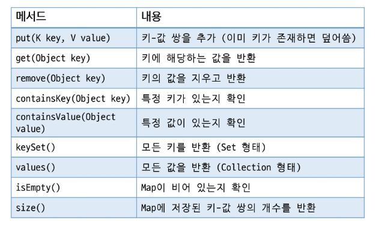
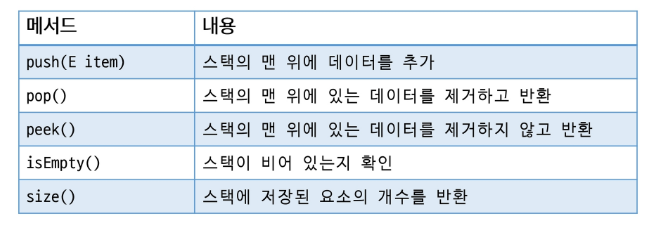
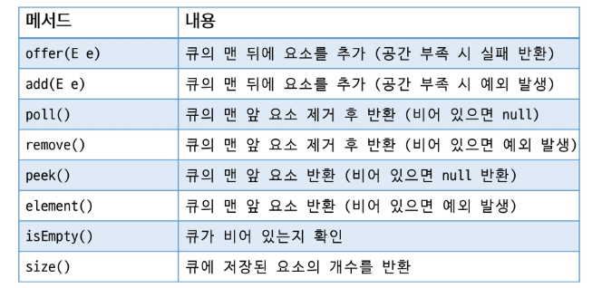
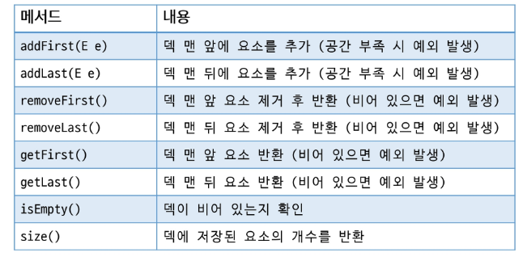
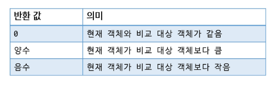
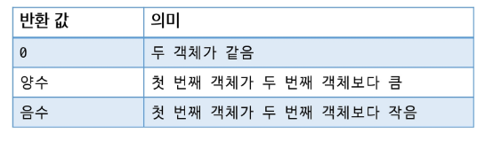

# Java
## 컬렉션프레임워크

### 컬렉션 프레임워크
#### 자료구조
- 데이터에 효율적으로 접근하기 위해 선택되는 데이터의 조직 및 저장 형식
- 데이터 값들의 모음, 이들 간의 관계, 데이터에 적용될 수 있는 연산의 모음

#### 자료구조의 분류
- 정적 자료구조: 크기가 고정된 자료구조(배열)
- 동적 자료구조: 크기가 변할 수 있는 자료구조(리스트, 스택, 큐)

#### 자료구조의 선택기준
- 데이터 접근 속도
- 메모리 사용 효율성
- 삽입 및 삭제의 효율성
- 순서 유지 여부
- 중복 데이터 허용 여부

#### 컬렉션 프레임워크
- 표준화된 데이터 구조와 이를 처리하기 위한 클래스 및 인터페이스의 집합
- 데이터를 동적 크기로 관리하고 사입, 삭제, 검색, 정렬 드을 효율적으로 처리할 수 있음
- 제네릭을 지원하여 타입 안전성 보장
- 표준화된 메서드 제공

#### List 계열 컬렉션
- 순서가 있는 데이터 집합
- 중복 데이터 허용
- 크기가 고정된 배열과 달리 크기가 동적으로 변함
- 구현 클래스
    - ArrayList
    - LinkedList
    - Vector

#### ArrayList
- 배열 기반의 구현 (크기가 커지면 자동으로 더 큰 배열을 만들어서 복사)
- 인덱스를 통한 접근이 빠름
- 데이터의 삽입, 삭제가 빈번한 경우 성능 저하
- 데이터의 조회가 많고 삽입/삭제가 적은 경우 유용

#### LinkedList
- 노드 기반의 구현
- 각 노드가 이전 노드와 다음 노드의 참조를 포함
- 데이터 삽입, 삭제가 빠름
- 데이터의 삽입 / 삭제가 많고 조회가 많이 없는 경우 유용

#### List 주요 메서드


```java
List<String> names = new ArrayList<>();

name.add("이규진"); //원소 추가
name.add(0, "문지후");

//set: 수정, remove: 하나만 삭제, clear: 전체 삭제, size: 사이즈, isEmpty: 비었는지
```

#### Set 계열 컬렉션
- 중복 데이터 허용하지 않음
- 순서 보장하지 않음
- null 허용
- 데이터의 고유성을 보장하기 위해 사용
- 구현 클래스
    - HashSet
    - LinkedHashSet
    - TreeSet

#### HashSet
- 데이터의 저장 순서를 유지하지 않음
- HashMap 기반으로 동작 -> 빠른 추가, 삭제, 검색이 가능
- null 값 하나 저장할 수 있음

```
Hash: 데이터를 빠르게 저장하고 검색하기 위해 사용하는 특별한 값 또는 기법
-> 데이터를 고유한 숫자 값으로 변환하는 과정
```

#### LinkedHashSet
- 데이터의 저장 순서를 유지함
- LinkedHashMap 기반으로 동작 -> 빠른 추가, 삭제, 검색이 가능
- 이중 연결 리스크를 이용하여 관리(약간 더 느림)
- null 가뵤 하나 저장할 수 있음

#### TreeSet
- 데잍터가 정렬된 상태로 유지
- 사용자 정의 정렬이 필요한 경우 Comparator를 사용할 수 있음
- null 값 사용 불가

#### Set 주요 메서드


```java
Set<String> names = new HashSet<>();

name.add("유아름");
name.add("박승연");
name.add("왕성민");
name.add("강건");
name.add("강건");
name.add("강건");

System.out.println(names); //[왕성민, 유아름, 박승연, 강건]
```

#### Map 계열 컬렉션
- 키와 값의 쌍으로 데이터를 저장하는 구조
- 키를 기준으로 값에 접근하여 키는 중복을 허용하지 않음 (값은 허용)
- 키를 활용하여 빠른 검색 가능
- 키 또는 값에 null 허용
- 구현 클래스
    - HashMap
    - LinkedHashMap
    - TreeMap

#### HashMap
- 데이터의 저장 순서를 유지하지 않음
- 내부적으로 Hash Table을 사용하여 데이터 저장 및 검색
- null 키를 하나 허용하며 여러 개의 null 값을 허용
- 빠른 검색, 삽입, 삭제를 지원

#### LinkedHashMap
- 데이터의 저장 순서를 유지
- 내부적으로 Hash Table + 이중 연결 리스트를 사용하여 데이터 저장 및 검색
- null 키를 하나 허용하며, 여러 개의 null 값을 허용
- 빠른 검색, 삽입, 삭제를 지원
- 해시 충돌 시 HashMap과 동일하게 처리

#### TreeMap
- 키를 기준으로 정렬된 상태로 데이터를 유지 (기본 오름차순)
- 사용자 정의 정렬이 필요한 경우 Comparator를 사용
- 내부적으로 레드-블랙 트리 기반으로 구현
- null 키는 허용하지 않음

#### Map 주요 메서드


```java
Map<String, String> map = new HashMap<>();

map.put("김희망", "Java");
map.put("강건건", "Java");
map.put("전해지", "Python");
map.put("전해지", "한글");

System.out.println(map.keySet());

// containsKey, containsValue
```

#### Stack
- 후입선출 구조
- Vector 기반으로 동작


```java
Stack<Integer> stack = new Stack<>();

stack.add(1);
stack.add(2);

System.out.println(stack.pop());
System.out.println(stack.peek()); // 제거하지 않고 반환
```

#### Queue
- 선입선출 구조
- 다양한 구현체가 있음


```java
Queue<Integer> queue = new LinkedList<>();

queue.add(1); //실패반환
queue.offer(2); //예외발생


queue.poll(); //null
queue.remove(); //예외발생
```

#### Deque
- 양방향 큐
- ArrayDeque, LinkedList 사용 가능


```java
Deque<String> deque = new ArrayList<>();

deque.addFirst("유아름");
deque.addLast("박승연");
deque.addFirst("이정은");

System.out.println(deque) // 이정은, 유아름, 박승연
```

### 정렬
- 요소들을 특정 기준에 맞추어 오름차순 또는 내림차순으로 배치하는 것
- 순서를 가지는 Collection들만 정렬 가능
- 자바 제공 클래스 -> Collection의 sort()를 이용하여 정렬
                -> 배열은 Arrays의 sort()를 이용하여 정렬

#### Comparable 인터페이스
- 객체의 기본 정렬 기준을 정의
- 클래스에 직접 구현
- compareTo(T o) 메서드를 구현하여 정렬 기준을 정의


#### Comparator 인터페이스
- 별도의 정렬 기준을 정의
- 정렬 기준이 여러 개 필요한 경우 유용
- 클래스 외부에서 정렬 기준을 정의하며 특정 필드나 사용자 정의 기준으로 정렬할 수 있음
- compare(T o1, T o2) 메서드를 구현하여 정렬 기준을 정의

- 1회성 객체 사용 시 anonymous inner class 사용
- 클래스 정의, 객체 생성을 한번에 처리
- 람다 표현식 사용