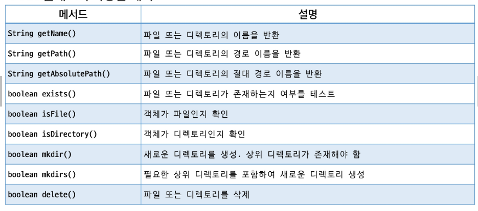
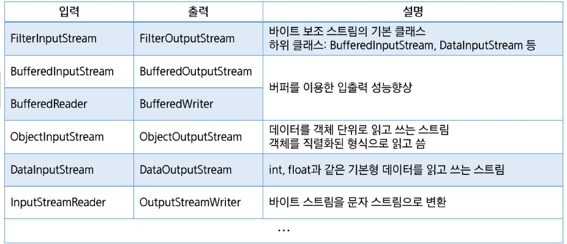

# Java
## 파일 입출력

### 파일
#### 파일 클래스
- 파일 및 디렉토리를 객체로서 관리
- 특정 파일 또는 디렉토리에 대응되는 객체를 생성
- 파일 및 디렉토리에 대한 정보를 관리하고 조작할 수 있는 다양한 메서드를 제공
- 파일 객체의 생성: 경로를 문자열로 전달, 해당 파일 또는 디렉터리 경로에 대응되는 객체 생성
```
File file = new File("경로");
```
- 문자열 경로는 상대 경로 또는 절대 경로를 사용

#### File 클래스의 다양한 메서드


### 입출력과 스트림
#### 입출력(I/O)
- 데이터의 입력 / 출력
- 컴퓨터 내부 혹은 외부의 장치와 데이터를 주고 받는 행위

#### 스트림
- 데이터를 운반하는데 사용되는 통로
- 물흐름과 같이 단방향으로만 통신 가능
- 하나의 스트림을 이용하여 입력과 출력 처리 불가능
- 데이터의 방향에 따라 입력 스트림, 출력 스트림으로 나뉨

#### 바이트 스트림
- 바이트 단위로 데이터를 입력받거나 출력하기 위한 스트림 클래스
- 주로 이진 파일을 읽고 쓰는 데 사용
- 최상위 추상 클래스: InputStream, OutputStream
- 노드의 종류에 따라 다양한 구체적인 서브 클래스 사용

#### InputStream 클래스
- 모든 바이트 입력 스트림의 최상위 추상클래스
- 바이트 단위로 데이터를 읽기 위한 여러 메서드를 제공
- 입력 소스 -> 프로그램 방향으로 흐름

#### OutputStream 클래스
- 모든 바이트 출력 스트림의 최상위 추상 클래스
- 바이트 단위로 데이터를 출력하기 위한 여러 메서드 제공
- 프로그램 -> 출력 대상 방향으로 흐름

#### 문자 스트림
- 바이트 스트림과는 달리 문자 단위 단위로 데이터를 처리
- 주로 키보드에서 입력을 받거나 텍스트 파일을 읽고 쓰는 데 사용
- 문자 스트림의 최상위 추상 클래스: Reader, Writer
- FileReader와 FileWriter가 파일에 텍스트를 읽거나 쓸 때는 현재 JVM이 돌아가고 있는 시스템의 기본 문자 인코딩 방식을 사용

#### Reader 클래스 
- 자바의 모든 문자 입력 스트림의 최상위 추상 클래스
- 문자 단위로 데이터를 입력 받기 위한 다양한 메서드 정의

#### Writer 클래스 
- 자바의 모든 문자 출력 스트림의 최상위 추상 클래스
- 문자 단위로 데이터를 출력하기 위한 다양한 메서드 정의

### 보조 스트림
#### 스트림의 종류: 노드 스트림, 보조 스트림

#### 노드 스트림
- 실제 노드에 연결
- 데이터의 실제 입출력을 담당

#### 보조 스트림
- 실제 노드에 연결되지 않음
- 다른 스트림을 감싸서 추가적인 기능을 제공
- 여러 보조 스트림을 체인 형태로 연결하여 다양한 기능을 조합할 수 있음
- 노드 스트림 없이 단독으로 사용할 수 없음
- 보조 스트림의 close()를 호출하면 노드 스트림의 close()까지 호출됨

#### 보조 스트림의 종류


### 객체 직렬화
#### 직렬화
- 객체의 상태를 바이트 스트림으로 변환하여 저장하거나 전송할 수 있도록 하는 과정
- 역직렬화: 직렬화된 바이트 스트림을 다시 객체로 복원하는 절차
- ObjectOutputStream: 객체를 바이트 스트림으로 변환하는 스트림
- ObjectInputStream: 바이트 스트림을 객체로 복원하는 스트림

#### 직렬화 가능 클래스 만들기
- 객체가 ObjectOutputStream에 의해 직렬화하기 위해서는 해당 객체의 클래스가 반드시 Serializable 인터페이스를 구현해야 함
- Serializable 인터페이스: 메서드를 포함하지 않으며 직렬화 가능 여부를 표시하는 마커 인터페이스
- 해당 인터페이스를 구현한 클래스를 상속받았다면 구현하지 않아도 됨
- 자손에만 구현했다묜 조상클래스는 직렬화되지 않음
- 직렬화 과정레서 제외하고 싶은 필드는 transient 키워드를 통해 직렬화 대상에서 제외시킬 수 있음
- serialVersionUID: 클래스의 버전 관리를 위해 serialVersionUID를 명시적으로 선언하는 것을 권장
- 클래스의 변경으로 인한 역직렬화 오류를 방지하는 데 사용