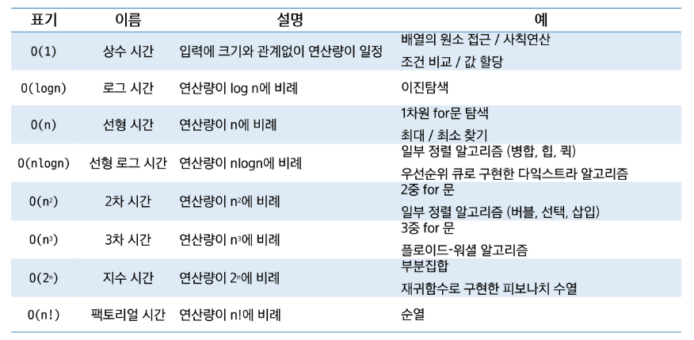
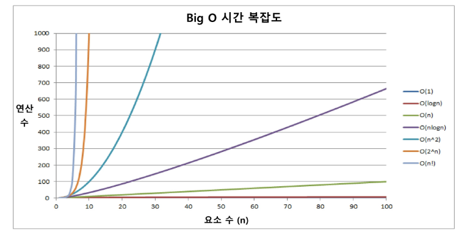
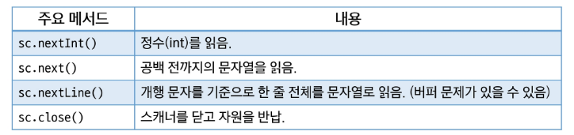
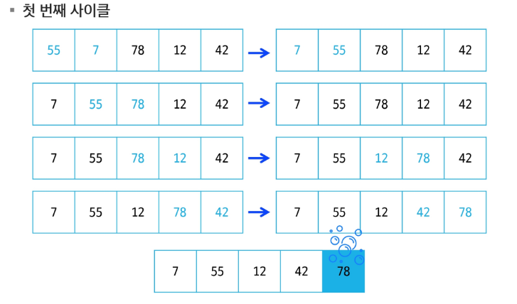
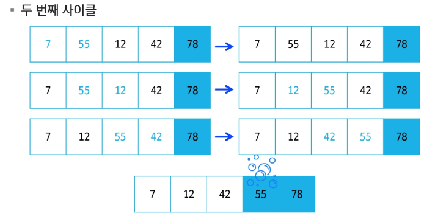
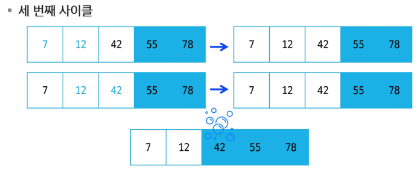
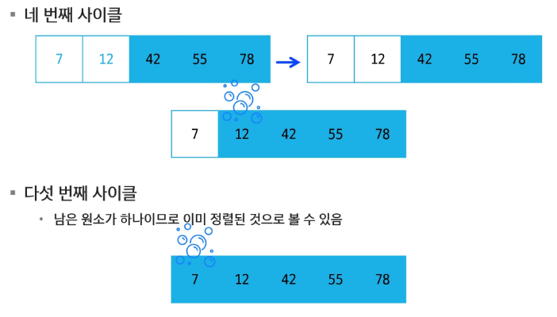
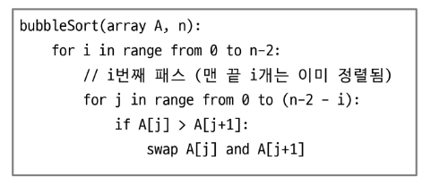

# Java
## Array1

### 알고리즘
- 문제를 해결하기 위해 수행해야 하는 절차나 방법ㅂ
- 컴퓨터 과학에서의 알고리즘 -> 원하는 결과를 얻기 위해 수행해야 하는 절차

#### APS
- 프로그래밍을 이용하여 주어진 문제를 해결하는 과정
- 자료구조, 알고리즘 기법 등을 익히는 과정

#### 무엇이 좋은 알고리즘인가?
- 정확성
- 작업량
- 메모리 사용량
- 단순성
- 최적성

#### 알고리즘을 표현하는 방법
- 자연어
- 순서도
- 의사코드
- Programming Language

#### 알고리즘의 성능
- 문제를 해결하기 위해 다양한 알고리즘을 적용해볼 수 있음-> 성능 분석이 필요!

#### 시간 복잡도
- 알고리즘이 문제를 해결하기 위해 얼마나 많은 연산을 수행해야하는지를 나타내는 척도
- 입력 크기가 커졌을 때 알고리즘의 처리 시간이 어떻게 증가하는지를 파악함으로써 향후 대규모 데이터에 대해서도 효율적으로 동작할지 예측 가능

#### 빅-오 표기법
- 시간 복잡도를 표현할 때 주로 사용되는 방법
- 시간 복잡도의 최댓값을 나타냄 -> 입력 크기 N이 매우 커졌을 때 연산 횟수가 어느 정도로 증가하는지를 나타내는 방식
- 시간 복잡도 함수 중에서 가장 큰 영향력을 주는 n에 대한 항만을 표시
- 계수는 생략하여 표시

#### 자주 사용되는 빅-오(O) 표기


- 시간 복잡도 비교 


---

### 1차원 배열
#### 배열
- 동일한 데이터 타입의 값들을 저장하기 위한 자료구조

#### 배열의 필요성
- 프로그램 내에서 여러 개의 변수가 필요할 때, 전부 다른 변수명을 이용하여 접근하는 것은 비효율적
- 배열을 사용하면 한 번의 선언을 통해서 여러 개의 데이터를 다룰 수 있음
- 단순히 여러 개의 변수를 편하게 사용하는 것이 아닌 다수의 변수로 하기 힘든 잡업을 배열을 통해 쉽게 활용할 수 있음

#### 1차원 배열의 선언 필요한 요소 3가지
1. 자료형: 배열을 이루는 자료형
2. 배열이름: 프로그램에서 사용할 배열의 이름
3. 길이: 배열을 이루는 요소의 값
- 자료형[] 배열이름 = new 자료형[길이]

#### 1차원 배열의 요소 접근
- 인덱스 값은 0부터 시작
- 배열의 길이를 벗어나는 값을 사용할 수 없음

#### 1차원 배열의 순회
```
for (   ;   ;   ) {

}
```

#### Scanner
- 표준 입력으로부터 데이터를 쉽게 읽어오기 위해 사용되는 클래스
```java
import java.util.Scanner;
Scanner sc = new Scanner(System.in);
```


---

### 버블 정렬
#### 정렬
- 데이터들을 일정한 규칙에 따라 순서대로 재배열하는 것
- 다양한 알고리즘에서 선행 작업으로 활용되기도 함
- 자바에서는 Arrays 클래스와 Collections 클래스에서 sort() 메서드를 지원함

#### 버블정렬
- 인접한 두 개의 원소를 비교하여 크기가 순서에 맞지 않는다면 서로 교환하는 과정을 반복하여 정렬하는 알고리즘
- 한 사이클이 끝날 때마다 가장 큰 원소가 끝에 위치하게 되는 모습이 거품이 올라오는 것과 유사하다고 하여 버블정렬이라고 부름
- 시간 복잡도: O(N^2)

#### 버블 정렬 과정
- 배열의  처음부터 끝까지 인접 원소를 짝지어 비교
- 비교한 두 원소의 순서가 잘못되어있다면 교환 -> 오름차순, 내림차순
- 한 사이클이 끝나면 배열의 마지막 인덱스에 가장 큰 원소가 위치
- 범위를 줄여 나가며 N - 1번 정도 반복 수행하면 정렬 완료






#### 버블 정렬 의사코드
