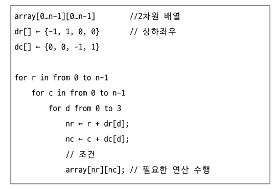
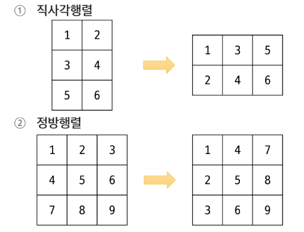

# APS 기본
## Array3

### 2차원 배열
- 배열의 각 요소가 또 다른 1차원 배열을 가리킴
- 열과 열의 구조 / 테이블 구조 / 좌표평면 구조 등

#### 2차원 배열의 선언
- 데이터타입[][] 배열이름 = new int[n][n];

#### 2차원 배열 인덱스
- 인덱스를 이용하여 요소에 접근
- arr[행 인덱스][열 인덱스]

#### 행 우선 순회
- 행을 고정시킨 뒤 열을 순회하는 방법

#### 열 우선 순회
- 열을 고정시킨 뒤 행을 순회하는 방법

#### 달팽이 순회
수평 -> 수직일 때 k-1만큼 줄어든다.

### 2차원 배열 응용
#### 델타를 활용한 이동
- 2차원 배열에서 상하좌우 또는 대각선 등 여러 방향으로 위치를 옮길 때. 규칙적으로 변하는 변화량을 정의하여 활용하는 방식

#### 전치행렬
- 행렬의 행과 열을 서로 바꾼 형태의 행렬

### 다차원 배열
- 배열 안에 또 다른 배열을 포함하는 구조
- 일반적으로 2차원 배열이 많지만 3차원 이상도 가능
- 표 형태 혹은 복잡한 계층 구조를 표현할 때 유용

- 배열 객체의 참조 값을 요소로 갖는 배열