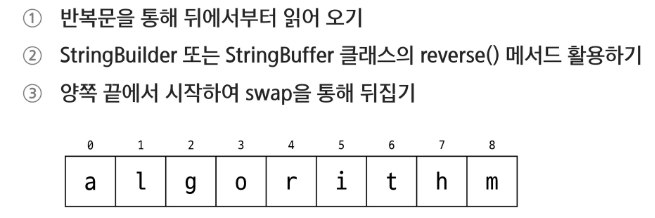
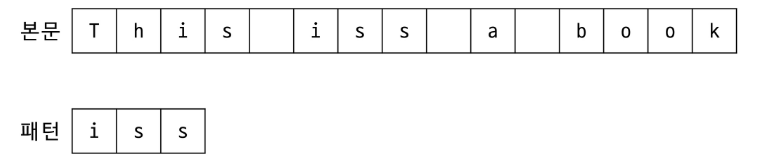
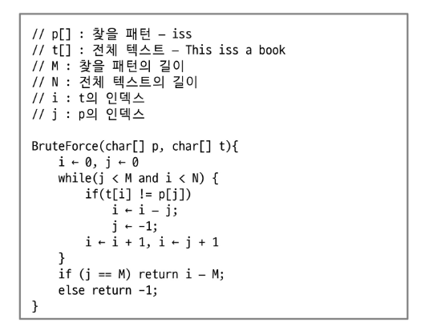

# APS
## String

### 문자 표현
#### 컴퓨터에서의 문자표현
- ASCII
- 7bit 인코딩으로 128 종류의 문자를 표현
    - 33개의 제어문자
    - 95개의 출력 문자

#### ASCII
- 48: 0
- 65: 'A'
- 97: 'a'

#### 유니코드
- ASCII 확정만으로는 전 세계 모든 문자를 표현하기 어려움
- 한글, 한자, 아랍어 등 여러 언어를 단일 체계에서 처리할 필요성이 대두
- 각 문자를 표현하는 숫자 값으로 U + XXXX(16진수) 형태로 표기

#### 유니코드 인코딩
- UTF-8
- UTF-16
- UTF-32

---

### 문자열
- 문자들의 나열 -> 문자들을 순서대로 저장한 자료구조
- 문자열의 구체적 표현 방식은 언어 / 환경에 따라 다름
- Java에서는 String 클래스

#### Stting 클래스의 특징
- 불변: 한 번 생성된 Sttring 객체는 내부 내용을 변경할 수 없음
- 힙에 저장 + String pool
-> 동일 리터럴이면 이미 존재하는 객체를 재사용
- 내부구조(UTF-16) 기반

```
String str = "Hello";
Str = Str + "World";
```

#### String 생성
- 리터럴 사용
- 생성자 사용

#### 회문
- 앞에서부터 읽는 것과 뒤에서부터 읽는 것이 동일한 문자열
- 회문 판별을 위해서는 문자열을 뒤집을 수 있어야 함 


---

### 패턴매칭
- 문자열에서 특정 규칙을 찾아내거나 해당 패턴의 일치 여부를 검사하는 과정
- 특정 키워드를 검색
- 사용자 입력이 형식에 맞게 작성하였는지 검사
- 데이터 추출 등에서 활용할 수 있음
- 정규 표현식을 이용할 수 있음

#### 패턴 매칭 알고리즘
- Brute Force
- Boyer-Moore
- Rabin-Karp
- KMP

#### Brute Force 알고리즘
- 본문 문자열을 처음부터 끝까지 차례대로 순회하면서 패턴 내의 문자들을 전부 비교하는 방식으로 동작

