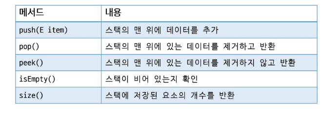

# APS
## Stack1

### 스택
- 자료를 쌓아 올린 형태의 자료구조
- 선형 자료구조 (1:1 관계)
- 후입선출
- top이라는 변수를 이용하여 마지막에 삽입된 원소를 가리킴

#### 스택의 주요 연산
- 삽입(Push): 스택의 맨 위에 원소를 삽입
- 삭제(Pop): 스택의 맨 위 원소를 꺼내서 반환
- 공백상태 확인(Empty): 스택이 비어있는지 확인
- 마지막 원소 확인(Peek): 스택의 맨 위 원소를 반환(삭제X)

#### 스택 구현
- 배열 활용
- 연결리스트 활용
- 구현 클래스(java.util.Stack)

---

### 스택 응용
- 괄호의 종류: 대괄호[], 중괄호{}, 소괄호()
- 여는 괄호와 닫는 괄호가 올바르게 짝을 이루는지 확인하는 과정
1. 여는 괄호와 닫는 괄호의 개수는 일치해야한다
2. 같은 괄호에서 여는 괄호는 닫는 괄호보다 먼저 나와야한다
3. 괄호 사이에는 포한 관계만 존재한다.

#### 괄호 짝 검사 알고리즘
- 문자열을 왼쪽부터 오른쪽으로 순회하며 한 글자씩 검사
- 여는 괄호가 나오면 스택에 push
- 닫는 괄호가 나오면
    - 스택이 공백상태라면 False
    - 스택에서 맨 위 여는 괄호를 Pop 해온 뒤 현재 닫는 괄호와 같은 쌍인지 확인
- 전체 순회가 끝난 뒤 스택이 공백상태이면 올바른 괄호 문자열(아니라면 짝이 맞지 않다는 뜻)

#### Function Call
- 프로그램에서 함수 호출과 복귀에 따른 순서를 관리
- 가장 마지막에 호출된 함수가 가장 먼저 실행을 완료하고 복귀하는 후입선출 구조
- 함수 호출 시 함수 수행에 필요한 지역변수, 매개변수, 복귀 주소 등의 정보를 스택 프레임에 저장하여 시스템 스택에 삽입
- 함수의 실행이 끝나면 시스템 스택의 top 원소를 Pop하여 복귀 주소로 복귀
- 프로그램 종료 시 시스템 스택은 공백이 됨

