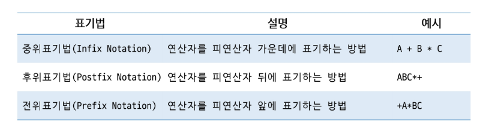
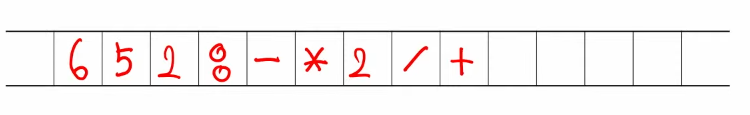

# APS
## Stack2

### 계산기 실습
#### 컴퓨터의 수 계산
- 사람이 일반적으로 사용하는 중위표기법을 사용하지 않고, 보다 처리하기 쉬운 형태로 변환하여 계산함
- 연산자의 우선순위와 괄호 처리 문제를 해결할 수 있음

#### 문자열로 된 계산식
- 스택을 활용하여 계산식의 값을 계산할 수 있음
1. 중위 표기법의 수식을 후위 표기법으로 스택을 이용하여 변경
2. 후위 표기법의 수식을 스택을 이용하여 계산

#### 중위 표기법 -> 후위 표기법 변환 방법
- 수식의 각 연산자에 대해서 우선 순위에 따라 괄호를 사용하여 다시 표현
- 각 연산자를 그에 대응하는 오른쪽 괄호 뒤로 이동시킨 뒤 괄호를 제거

#### 중위 표기법 -> 후위 표기법 변환 방법2 (스택 이용)
- 입력 받은 중위 표기식을 한 글자씩 읽으면서 진행
- 피연산자이면 출력
- 연산자이면 스택에 저장
    - 현재 연산자의 우선순위가 스택의 연산자보다 높으면 Push, 높지 않다면 스택에서 기존 연산자를 Pop하여 출력 후 현재 연산자를 Push
    - '('여는 괄호라면 스택에 push -> 우선순위가 가장 높음
    - ')' 닫는 괄호라면 여는 괄호까지 연산자를 꺼내어 출력
- 과정 종료 후 스택에 남아있는 모든 연산자를 Pop하여 출력

#### 후위 표기법의 수식을 스택을 이용하여 계산
1. 피연산자를 만나면 스택에 Push
2. 연산자를 만나면 필요한 만큼의 피연산자를 스택에서 Pop하여 연산하고 결과를 다시 Push
3. 수식이 끝나면, 마지막으로 스택을 Pop하여 출력

---

### 재귀함수
- 자기 자신을 호출하여 순환 수행되는 것
- 반복을 대신할 수 있음
- 함수 호출은 메모리 구조에서 스택을 사용
- 간단한 문제에 대해서는 반복문에 비해 메모리 및 속도에서 성능 저하가 발생

#### 재귀함수 구조
- 일반적으로 기본 부분, 재귀 부분으로 구성
- Base case: 재귀 호출에서 빠져나가기 위한 조건
- Recursive case: 자신을 호출하는 부분
- 재귀적 프로그램을 작성하는 것은 반복 구조에 비해 간결하고 이해하기 쉬움

#### 재귀함수의 예시
- 피보나치
- 하노이 탑