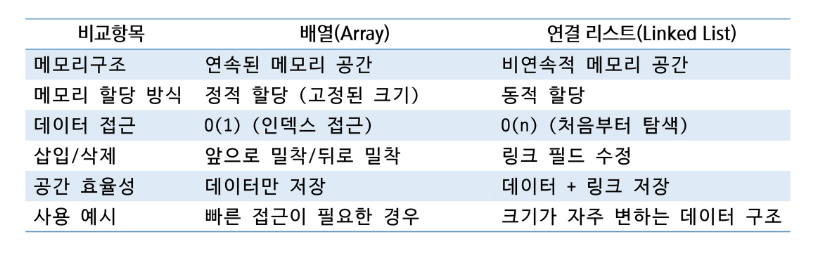

# APS
## Linked List1

### 연결리스트
- 노드가 데이터와 다음 노드의 참조를 포함하는 방식으로 구성된 자료구조
- 연속된 메모리 공간에 저장하는 배열과는 달리 비연속적인 위치에 저장 가능
- 자료구조의 크기를 동적으로 조정할 수 있어 메모리 효율적
- 처음 노드의 위치를 저장하는 Head가 필요함

#### 노드
- 자료구조에서 데이터를 저장하는 기본 단위
- 연결리스트, 트리, 그래프 등의 자료구조에서 사용
- 노드의 구성 요소
    1. 데이터필드: 노드가 저장하는 값(숫자, 문자열, 객체 등)
    2. 링크 필드: 다음 노드를 가리키는 참조
- 사용하는 자료구조에 따라 링크 필드가 여러 개 존재할 수 있음

#### 연결리스트 vs 배열

---

#### 단일 연결 리스트
- 각 노드가 하나의 링크 필드에 의해 다음 노드와 연결되는 구조
- Head는 가장 앞의 노드를 가리키고, 각 노드는 다음 노드를 가리킴
- 마지막 노드의 링크 필드는 null(다음 노드가 없음)
- 단순 연결 리스트(Simple Linked List) 라고도 함

---

### 연결 스택
- 연결 리스틀를 이용하여 스택을 구현
- Push
- Pop
- Head 대신에 Top으로 대체하여 작성 (Top이 Null이면 초기 값)

### 연결 큐
- 연결 리스트를 이용하여 큐를 구현
- enQueue
- deQueue
- front
- rear