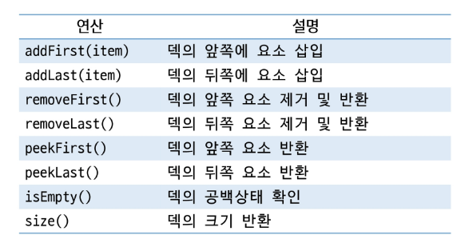
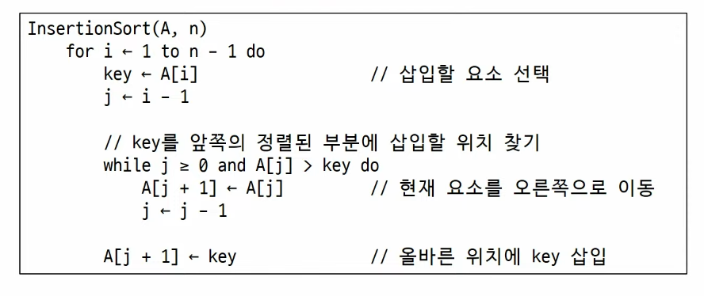

# APS
## Linked List2

### 이중 연결 리스트
- 각 노드가 이전 노드와 다음 노드를 모드 가리키는 연결되는 구조
- 두 개의 링크필드와 한 개의 데이터 필드로 구성

#### 이중 연결 리스트 삽입
- cur가 가리키는 노드 다음으로 'D' 값을 가진 노드를 삽입하는 과정
1. 메모리를 할당하여 새로운 노드 new를 생성하고 데이터 필드에 'D'를 저장한다.
2. cur의 next를 new의 next에 저장하여 연결한다.
3. cur의 주소룰new의 prev에 저장하여 연결한다.
4. new의 주소를 cur의 next에 저장하여 연결한다.
5. new의 주소를 new의 오른쪽 노드의 prev에 저장하여 연결한다.

#### 이중 연결 리스트 삭제
1. 현재상태
2. 삭제할 노드 cur의 오른쪽 노드의 주소를 cur의 왼쪽 노드의 next에 저장하여 연결한다.
3. 삭제할 노드 cur의 왼쪽 노드의 주소를 cur의 오른쪽 노드의 prev에 저장하여 연결한다.
4. cur가 가리키는 노드의 할당된 메모리를 반환한다.

---

### 원형 연결 리스트
- 마지막 노드가 첫번째 노드를 가리켜 원형으로 연결되는 구조
-> null이 아니라 Head를 가리킴
- 시작점을 임의로 지정할 수 있어 회전 큐에 활용

---

### 데크
- 양쪽 끝에서 삽입과 삭제가 모두 가능한 자료구조
- 중간에 있는 데이터는 직접 접근할 수 없고 양 끝을 통해서만 접근 가능
- java.util.Deque, java.util.ArrayDequqe 지원

#### 데크 주요 연산

---

### 삽입 정렬
- 리스트의 각 요소를 차례대로 정렬된 부분에 삽입하면서 정렬하는 방식
- 데이터를 정렬된 부분과 정렬되지 않은 부분으로 나누어 정렬된 부분을 늘려나가는 방식
- 추가적인 메모리 공간이 필요 없음
- 안정 정렬
- 시간 복잡도(최악): O(N^2)
- 시간 복잡도(최선): O(N)

#### 삽입 정렬 과정
- 정렬할 자료를 두 개의 부분집합 S와 U로 가정
    - 부분집합 S: 정렬된 앞 부분의 원소들
    - 부분집합 U: 아직 정렬되지 않은 나머지 부분의 원소들
- 정렬되지 않은 부분집합의 U의 원소를 하나씩 꺼내어 S의 마지막 원소부터 비교하며 위치를 찾아 삽입
- U가 공집합이 되면 정렬이 완성된다

#### 삽입 정렬 의사코드
