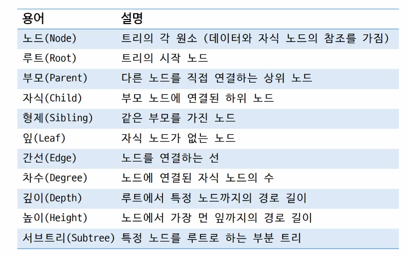
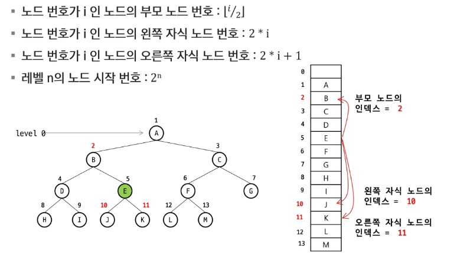
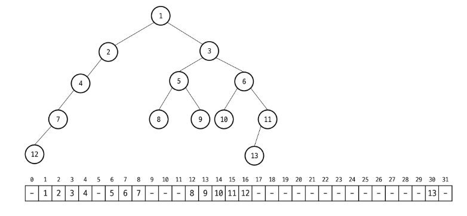
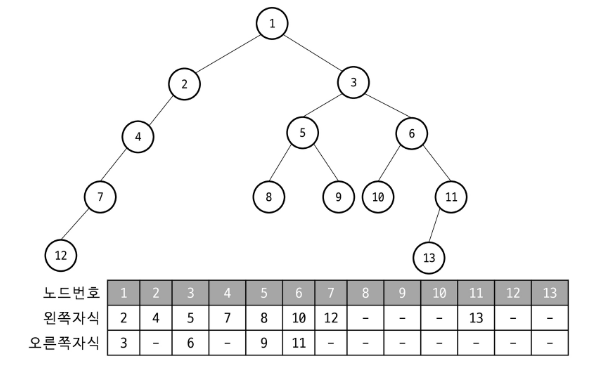

# APS
## Tree

### 트리
- 계층적 구조를 표현하는 비선형 자료구조
- 1 : N의 관계를 가지는 자료구조
- 한 개 이상의 노드로 이루어진 유한 집합
- 상위 원소에서 하위 원소로 내려가면서 확장되는 트리모양의 구조
- 사이클 없음

#### 트리 용어

---

### 이진 트리
- 각 노드가 최대 2개의 자식(왼쪽, 오른쪽)을 가지는 트리
-> 자식 노드는 0/ 1/ 2개
- 특정 레벨 i에서의 노드의 최대 개수는 2^i개
- 높이가 h인 이진 트리가 가질 수 있는 노드의 최소 개수는 (h + 1)개, 최대 개수는 (2^h+1 -1)개

#### 포화 이진 트리
- 모든 레벨에 노드가 포화 상태로 차 있는 이진 트리
- 리프 노드의 깊이가 같음
- 높이가 h일 때, 최대 노드 개수인 (2^h+1 -1)개 노드를 가진 이진 트리

#### 정 이진 트리
- 모든 노드가 0개 또는 2개의 자식을 가진 이진 트리
- 자식 노드가 1개인 노드는 존재하지 않음
- 리프 노드의 깊이는 다를 수 있음

#### 완전 이진 트리
- 마지막 레벨을 제외한 모든 레벨이 꽉 차 있고, 마지막 레벨의 노드는 왼쪽부터 채워지는 트리

#### 편향 이진 트리
- 모든 노드가 한쪽 자식 노드만 가짐
- 왼쪽 편향 이진 트리
- 오른쪽 편향 이진 트리

#### 이진 탐색 트리(BST)
- 왼쪽 자식 < 부모 < 오른쪽 자식의 규칙을 따르는 이진 트리

#### 균형 이진 트리
- 모든 서브트리의 높이 차이가 일정 이하로 유지되는 트리
- AVL트리, 레드-블랙 트리 등이 균형 이진 트리에 속함

#### 배열을 이용한 이진 트리 표현
- 이진 트리에 각 노드 번호를 다음과 같이 부여 (루트 노드: 1번)
- 레벨 N에 있는 노드에 대하여 왼쪽부터 오른쪽으로 2^n 부터 2^n+1 -1까지 번호를 차례로 부여

#### 배열을 이용한 이진 트리 표현

- 1차원 배열을 이용한 저장 방식

- 2차원 배열을 이용한 왼쪽 자식, 오른쪽 자식 저장 방식(부모의 정보를 저장할 수도 있음)

#### 배열을 이용한 이진 트리 표현 단점
- 편항 이진 트리의 경우에 사용하지 않는 배열 원소에 대한 메모리 공간 낭비 발생
- 트리의 중간에 새로운 노드를 삽입하거나 기존의 노드를 삭제할 경우 배열의 크기 변경이 어려움

#### 연결 리스트를 이용한 이진 트리 표현
- 배열의 단점을 보완하기 위해 연결리스트를 이용하여 트리를 표현할 수 있음
- 이진 트리의 모든 노드는 최대 2개의 자식 노드를 가지므로 일정한 구조의 노드 활용

---

### 이진 트리 순회
#### 순회
- 트리의 노드들을 중복되지 않게 전부 방문하는 것을 말함
- 트리는 비선형 구조이므로 선형 구조와 같이 선후 연결 관계를 알 수 없음

#### 기본 순회
- 전위 순회: VRL  
-> 부모 노드 방문 후, 자식 노드를 좌, 우 순서로 방문

- 중위 순회: LVR 
-> 왼쪽 자식 노드, 부모 노드, 오른쪽 자식 노드 순으로 방문

- 후위 순회: LRV 
-> 자식 노드를 좌, 우 순서로 방문한 후, 부모 노드를 방문

- 변하지 않는 것: L -> R

#### 전위 순회
1. 현재 노드 n을 방문하여 처리한다
2. 현재 노드 n의 왼쪽 서브 트리로 이동한다
3. 현재 노드 n의 오른쪽 서브 트리로 이동한다

#### 중위 순회
1. 현재 노드 n의 왼쪽 서브트리로 이동한다
2. 현재 노드 n을 방문하여 처리한다
3. 현재 노드 n의 오른쪽 서브 트리로 이동한다

#### 후위 순회
1. 현재 노드 n의 왼쪽 서브 트리로 이동한다
2. 현재 노드 n의 오른쪽 서브 트리로 이동한다
3. 현재 노드 n을 방문하여 처리한다