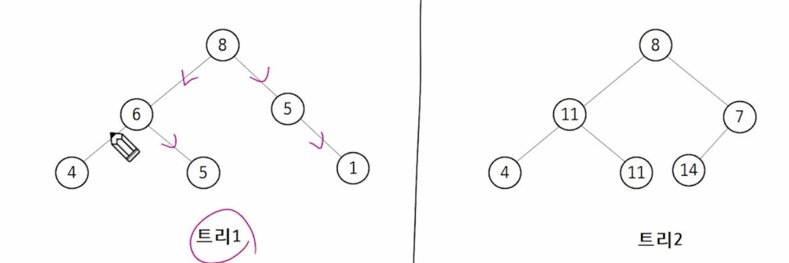

# APS

## Heap

### 힙

- 완전 이진트리를 기반으로 하는 특수한 트리 기반의 자료구조
- 부조-자식 간의 특정한 순서를 따르는 자료구조
- 최댓값 또는 최솟값을 빠르게 찾을 수 있는 특성을 가짐
- 우선순위 큐를 구현하는데 주로 사용
- 삽입, 삭제, 탐색 연산을 효율적으로 수행

#### 최대 힙

- 키 값이 가장 큰 노드를 찾기 위한 완전 이진 트리
- 부모 노드의 키 값 >= 자식 노드의 키 값
- 루트 노드: 키 값이 가장 큰 노드

#### 최소 힙

- 키 값이 가장 작은 노드를 찾기 위한 완전 이진 트리
- 부모 노드의 키 값 <= 자식 노드의 키 값
- 루트 노드: 키 값이 가장 작은 노드

#### 힙이 아닌 이유는?

1. 완전 이진 트리가 아님
2. 부모 자식 간 규칙을 따르지 않음

#### 힙의 삽입 연산

1. 새 요소를 트리의 끝에 삽입
2. 부모 노드와 비교
3. 힙 속성이 위반된 경우, 부모와 교환
4. 힙 속성이 만족될 때까지 2, 3 반복 수행

- 시간 복잡도: O(logN)

#### 힙의 삭제 연산

1. 루트 노드를 제거
2. 마지막 노드를 루트로 이동
3. 자식 노드와 비교
4. 힙 속성 위반시, 자식과 교환
5. 힙 속성이 만족될 때까지 3, 4 반복 수행

- 시간 복잡도: O(logN)

---

### 힙 구현

#### 우선순위 큐

- 선입 선출이 아닌 자료의 우선순위에 따라 출력이 달라짐
- 배열을 이용한 구현
- 연결리스트를 이용한 구현
- Heap 자료구조를 활용한 구현
- java.util.PriorityQueue를 활용

#### 힙 정렬

- 힙 자료구조를 활용한 비교 기반 정렬 알고리즘

1. 정렬하고 싶은 모든 요소를 힙에 삽입(반복)
2. 힙에서 순차적으로 값을 삭제하여 출력

- 중간에 값을 다시 넣었다가 빼면 정렬이 틀어질 수 있음
- 시간 복잡도: O(N logN)
