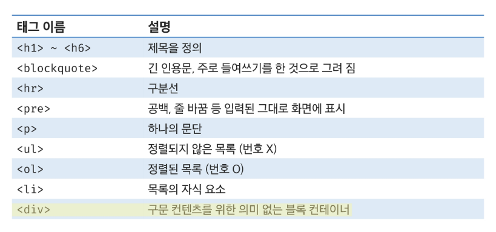
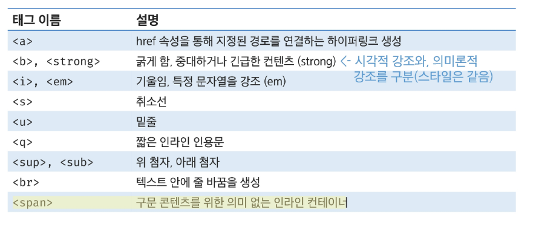
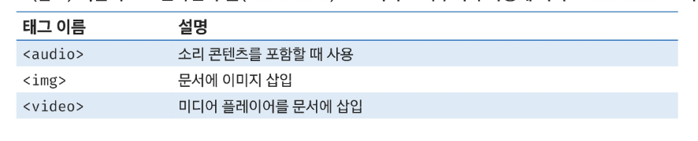
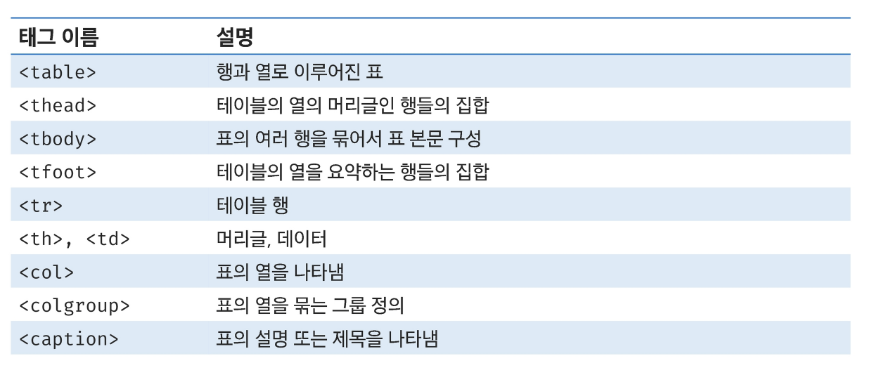
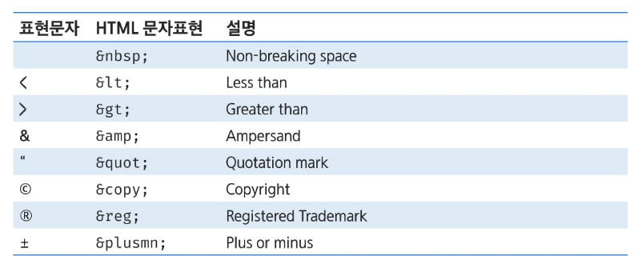
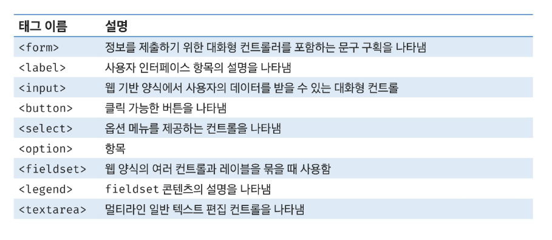
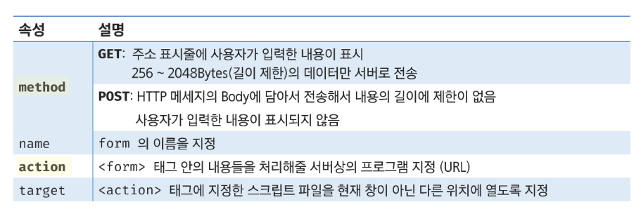
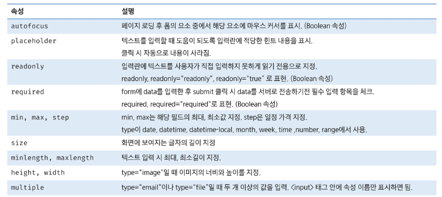
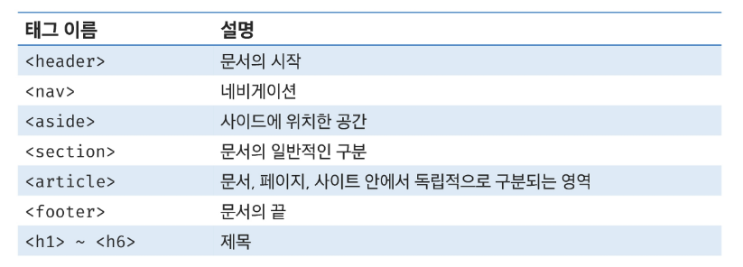

# Web(Front)

## HTML

### Web 소개

#### 웹 사이트

- 웹 사이트는 웹 페이지들의 모음
- 웹 사이트는 브라우저를 통해 동작

#### 웹과 브라우저

- 웹 브라우저: 인터넷 웹 페이지를 볼 수 있게 해주는 프로그램(클라이언트)
- 웹 브라우저마다 동작이 조금씩 달라서 실행에 문제가 생기는 경우 있음(웹 파편화)
- 이러한 문제를 해결하기 위해서 웹 표준이 있음

#### 웹 표준

- 웹에서 사용되는 표준 기술이나 규칙
- 브라우저 종류에 관계없이 동일하게 보이도록 가이드 제공 
  `웹 표준을 준수하여 웹페이지를 작성해야만 웹 파편화를 최소화할 수 있다`

#### Web의 구성

- 웹 페이지를 만들기 위한 기본 기술들
- HTML: 구조
- CSS: 표현
- JS: 동작

- 웹페이지를 만드는 것은 마치 건물을 짓는 것과 유사
- 구조 -> 디자인 -> 동적인 기능 부여

---

### 개발환경

#### 크롬 개발자 도구

- Elements: 해당 요소의 HTML 태그
- Elements에서 HTML 태그 구조를 탐색하여 추가/삭제/이동/편집 등이 가능

---

### HTML

- Hyper Text Markup Language
- Hyper Text: 참조를 통해 한 문서에서 다른 문서로 즉시 접근할 수 있는 텍스트
- Markup Language: 태그 등을 이용하여 문서나 데이터의 구조를 정의하는 언어

- HTML은 마크업 언어이지만 프로그래밍 언어는 아니다.
- 웹 페이지를 작성(구조화)하기 위한 언어
  -> 콘텐츠와 구조를 정의. 브라우저에게 구조화된 콘텐츠를 전달하는 역할

---

### HTML 구성요소

- `<html></html>`
- HTML 최상위 요소로 페이지 전체의 컨텐츠를 감싸는 루트 요소
- 문서내에서 사용할 문자 코드를 lang속성에 지정

- `<head></head>`
- HTML 문서에 표현하고 싶은 구성요소 와의 재료들을 담고있는 공간
- 페이지 이름, CSS, favicon 등을 작성
- 브라우저 화면에 출력되지 않음

- `<body></body>`
- 브라우저 회면에 나타나는 정보로 HTML 문서에 보여줄 모든 요소를 작성하는 공간

#### 요소와 태그

- HTML의 요소는 태그와 내용으로 구성
- 시작태그 /종료태그로 쌍을 이뤄야함
- 내용이 없으면 열고 바로 닫는 형태로 작성할 수 있음
- 요소는 중첩될 수 있음

#### 속성

- 태그에 추가적인 정보를 제공하는 역할
- 속성은 속성명과 속성값으로 이루어져있음
- 요소는 속성을 가질 수 있으며, 경로나 크기와 같은 추가 정보를 제공
- 요소의 시작 태그에 작성하며 보통 이름과 값이 하나의 쌍으로 존재

- 각 태그별로 사영할 수 있는 속성이 다름

  - a: href, target, rel
  - img: src, alt, width, height

- 태그와 상관없이 사용 가능한 속성
  - id: 문서 전체에서 유일한 고유 식별자를 지정하기 위한 속성
  - class: 여러 태그에 공통적인 특성을 부여하기 위한 속성
  - style: 인라인 스타일을 부여하기 위한 속성

#### 주석

- 주석의 내용은 브라우저에 출력되지 않음
- HTML Tag의 내용을 설명하기 위한 용도로 사용

#### DOM 트리

- HTML 문서를 브라우저에 렌더링하기 위한 구조
- 계층적 구조로 문서를 표현하여 요소 관계가 명확
  - 조상관계
  - 자손관계
  - 부모관계
  - 형제관계
- 모든 HTML요소, 속성, 텍스트는 각각 하나의 노드로 취급
- 부모/자식/형제 요소를 쉽게 탐색 가능

---

### 인라인/ 블록 요소

#### 블록 요소

- 항상 새로운 줄에서 시작
- 너비가 100% 가득 참
- 높이와 너비, 바깥 여백 값(margin), 안쪽 여백(padding)의 상하좌우 값 설정 가능

#### 인라인 요소

- 줄바꿈 없이 같은 줄에서 시작
- 컨텐츠 크기 만큼만 공간 차지
- margin, padding 좌우만 적용

#### Block Content

#### Inline Text Content

#### image & multimedia

- 멀티미디어를 웹페이지에서 활용할 수 있도록 해주는 태그
- 기본적으로 인라인 수준 요소이나 브라우저나 속성아 따라 인라인블록으로 지정

#### Table Content

#### 특수문자

---

### form

- 사용자의 정보를 제출하기 위한 영역
- 어디 위치로 어떤 방식을 보내겠다
- 로그인/회원가입, 검색 기능, 설문조사, 주문, 게시글 등등

#### label

- label을 클릭하여 input 자체의 초점을 맞추거나 활성화 시킬 수 있음
- 시용자는 선택할 수 있는 영역이 늘어나 웹/모바일 환경에서도 편하게 사용 가능
- label과 input 입력의 관계가 시각적으로 늘어날 뿐만 아니라 스크린 리더에서도 label을 읽으므로 구조 파악에 쉽도록 보조하는 역할을 수행하기도 함

#### Semantic Tag

- 시멘틱 태그를 사용함으로써 콘텐츠의 의미와 구조를 명확하게 해준다
- 검색엔진 최적화
- 웹 접근성 향상
- 코드 가독성 향상
