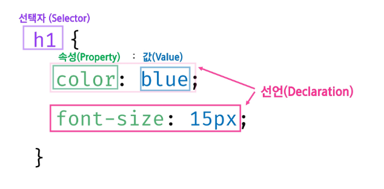

# Web(Front)

## CSS1

### CSS

- HTML 문서를 화면에 표시하는 스타일을 지정하기 위한 언어
- 웹 문서의 내용과 관계없이 디자인만 바꿀 수 있음
- 다양한 기기에 맞게 반응형으로 바뀌는 문서를 만들 수 있음
- 레이아웃 구성 및 배치
- 애니메이션 및 전환 효과

#### 기본구조

- CSS 구문은 선택자를 통해 스타일을 지정할 HTML 요소를 선택
- 중괄호 안에서는 속성과 값, 하나의 쌍으로 이루어진 선언을 진행
- 각 쌍은 선택한 요소의 속성, 속성에 부여할 값을 작성

#### 주석

- 주석의 내용은 style 탭에 표시되지 않음
- ` /* 주석 */`

#### CSS 정의 방법

- 인라인 참조: 개별 요소 내 style 속성
- 내부 참조: `<head>` 태그 내 `<style>` 태그
- 외부 참조: css 파일 작성 후 `<link>` 태그 사용

#### CSS 선택자

- 기본 선택자
  - 전체 선택자
    - HTML 문서 내 모든 요소를 선택
    - `* {style properties}`
  - 유형 선택자
    - 요소의 이름 - 태그를 이용하여 스타일을 적용
    - HTML 내에서 주어진 유형의 모든 요소를 선택
    - `element {style properties}`
  - 아이디 선택자
    - ID 특성 값을 비교하여 동일한 ID를 가진 태그를 선택
    - HTML 내에서 주어진 ID를 가진 요소가 하나만 있는 것을 지향
    - `#id명 {style properties}`
  - 클래스 선택자
    - Class 가 적용된 모든 태그를 선택
    - HTML 내에서 동일한 클래스 명을 중복해서 사용 가능
    - `.class명 {style properties}`
  - 특성 선택자
    - 태그의 속성명과 속성값을 활용하여 요소를 선택
    - HTML 내부에서 동일한 특성을 가진 요소느 모두 선택
    - `[property value] {style value}`
  - 선택자 목록
    - ,를 이용하여 선택자 그룹을 생성하는 방법
    - 일치하는 모든 노드를 선택
    - `element, element ...{style properties}`

---

### CSS 결합자

#### 자손 결합자

- 첫번쨰 요소의 자소인 노드를 선택
- 공백 사용
- `selector1 selector2 {style properties}`

#### 자식 결합자

- 첫번째 요소의 바로 아래 자식인 노드를 선택
- '>'를 사용
- `selector1 > selector2 {style properties}`

#### 일반 형제 결합자

- 첫번째 요소를 뒤따르면서 같은 부모를 공유하는 두번째 요소를 모두 선택
- ~ 를 사용
- `former-element ~ target-element {style property}`

#### 인접 형제 결합자

- 첫 번쨰 요소의 바로 뒤에 위치하면서 같은 부모를 공유하는 두번째 요소 선택
- +를 사용
- `former-element + target-element {style property}`

### 상속

- 부모 요소에 적용된 스타일이 자식 요소에 상속이 될 수도 있고 안될 수도 있음
- 상속되는 속성
  - 요소의 상속되는 속성에 값이 지정되지 않은 경우, 요소는 부모 요소의 해당 속성의 계산 없을 얻음
  - ex) Text 관련 요소
- 상속되지 않는 속성
  - 요소의 상속되지 않는 속성에 어떤 값이 지정되지 않는 경우 , 요소는 그 속성의 초기값을 얻음
  - ex) Box Model
