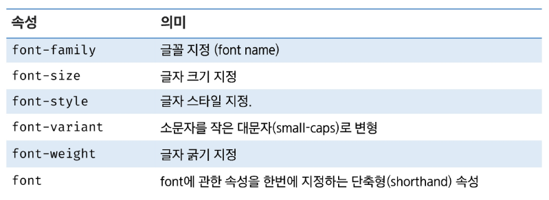
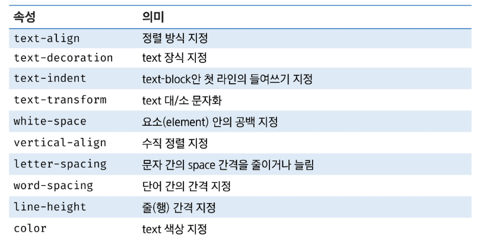
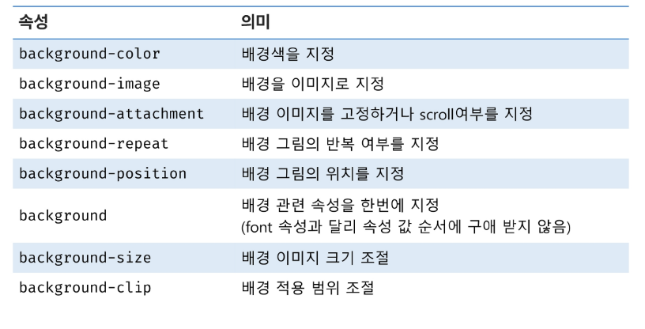
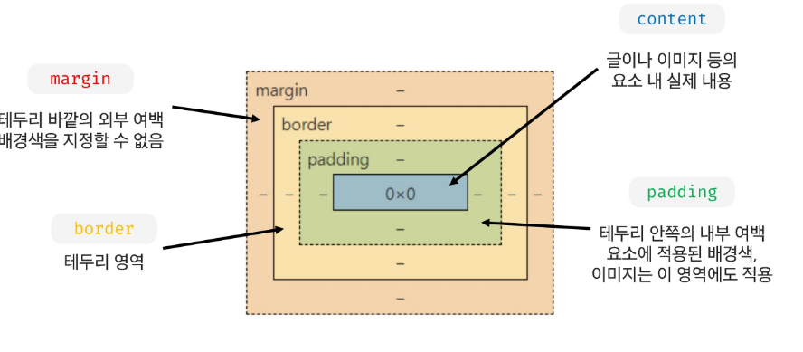
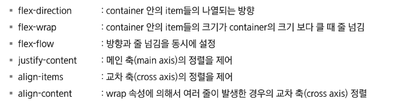

# Web(Front)

## CSS2

### CSS단위 -크기

#### 대표적인 CSS 크기 단위

- px: 고정된절대값, 모니터 해상도의 한 화소인 '픽셀'을 기준
- rem: 지정한 루트 요소 글꼴 크기의 배수
- em: 현재 지정한 폰트 크기의 배수

#### CSS 크기 단위

- auto
  - 너비: 내용물 설정
  - 여백: 부모 요소에서 설정할 수 있는 만큼 %

#### 색상 단위

- 색상 키워드
- RGB색상
- HSL색상

---

### CSS 속성

#### font

#### text

#### background

---

### Box model

### display

#### position

- static: 일반적인 배치 순서를 따름
- relative: 자기 자신의 static 위치를 기준으로 이동
- absolute: static이 아닌 가장 가까운 부모/조상 요소를 기준으로 이동
- fixed: 부모 요소 관계없이 viewport를 기준으로 이동
- sticky: 스크롤에 따라 static -> fixed로 변경

---

### CSS Layout

#### float

- float 속성은 박스를 어느 위치에 배치할 것인지를 결정하기 위해 사용

#### clear

- float 속성이 가지고 있는 값을 초기화하기 위해 사용

---

### flexbox

- 인터페이스 내의 아이템 간 공간 배분과 강력한 정렬 기능을 제공하기 위한 1찰원 레이아웃 모델로 설계

#### 축

- Main Axis
- Cross Axis

#### 구성요소

- Flex Container
  - flexbox 레이아웃을 형성하는 가장 기본적인 모델
  - flex item들이 놓여있는 영역
  - display 속성을 이용하여 container 생성성
- Flex item

#### flexbox 속성

