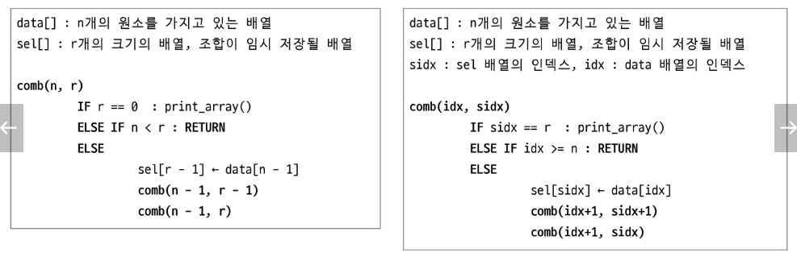
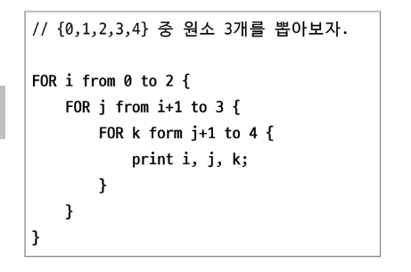
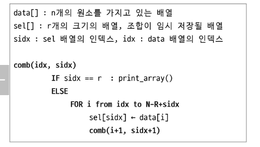
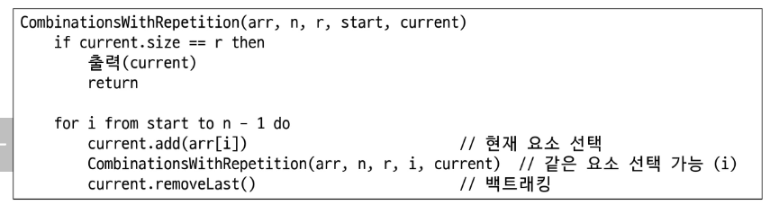

# APS
## 조합

### 조합
- 순서에 상관없이 주어진 집합에서 일부 원소를 선택하는 방법의 수

#### 조합의 성질
- 대칭성
- 항등식
- 파스칼의 법칙

---

### 조합 구현

#### 조합구현(재귀함수)

#### 조합 구현(반복문)
- 원소의 개수가 고정적일 때 용이

#### 조합 구현(재귀 + 반복문)

---

### 중복조합
- n개의 항목 중에서 r개를 선택할 때,중복을 허용하고, 순서를 고려하지 않는 경우의 수

#### 중복 조합 의사코드
