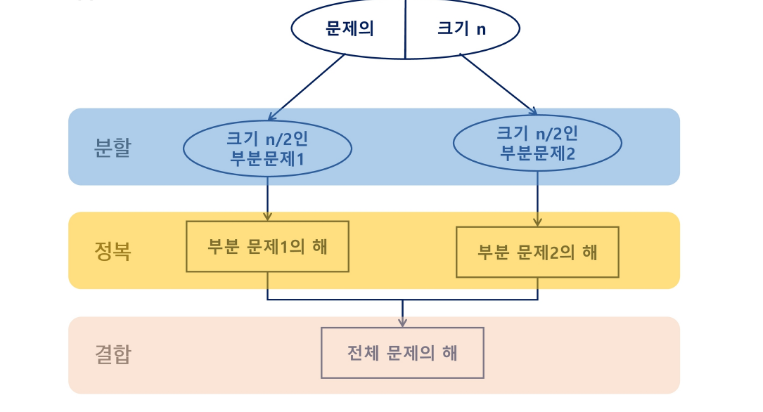
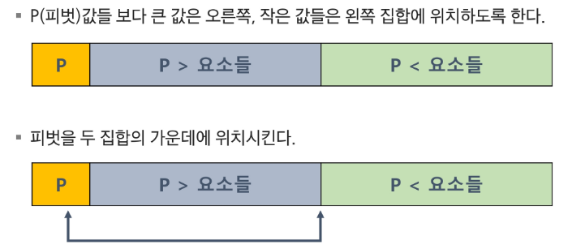

# APS
## 분할정복

### 분할정복
- 큰 문제를 작은 하위 문제로 나누어 해결하는 방식

#### 설계 전략
- 분할: 해결할 문제를 여러개의 작은 부분으로 나눈다
- 정복: 나눈 작은 문제를 각각 해결한다
- 결합: 해결된 해답을 모은다

#### Top-down approach

----

### 이진검색
- 정렬된 배열에서 특정한 값을 빠르게 찾기 위한 알고리즘
- 검색 범위를 반으로 줄여가면서 보다 빠르게 검색을 수행함
-> 미리 정렬되어 있어야하고 크기가 작은 배열에서는 크게 이점이 없을 수 있음

#### 검색 과정
1. 중앙 값 찾기
2. 목표 값과 중앙 값 비교
    1. 같은 경우: 종료
    2. 목표값이 중앙값보다 작을 경우: 왼쪽 절반 검색 수행
    3. 목표값이 중앙값보다 클 경우: 오른쪽 절반 검색 수행
3. 탐색 범위가 한 개의 원소가 될 때까지 반복 수행

---

### 병합 정렬
- 분할 정복 기법을 활용한 안정적인 정렬 알고리즘
- 배열을 절반으로 분할하고, 각 부분을 재귀적으로 정렬한 뒤, 정렬된 부분 배열을 다시 병합핮는 정렬 방식
- 시간 복잡도(NlogN)
- 추가적인 공간 필요

### 단계 별 동작
- 분할: 주어진 배열을 반으로 나눈다
- 정복: 각 부분 배열을 재귀적으로 병합 정렬을 사용해 정렬한다
- 병합: 정렬된 부분 배열들을 합쳐 전체 배열을 정렬한다

---

### 퀵 정렬
- 분할 정복 기법을 활용한 효율적인 정렬 알고리즘
- 피벗이라는 기준 요소를 선택하여 배열을 두 부분으로 분할하고, 재귀적으로 정렬하는 방식
- 추가적인 공간을 필요치 않아 함

#### 단계 별 동작
- pivot 결정
- 분할: 피봇보다 작은 요소는 왼쪽에, 큰 요소는 오른쪽에 위치하도록 배열을 나눈다
- 정복: 분할된 배열을 다시 재귀적으로 정복한다
- 병합: 따로 필요치 않음

#### 퀵 정렬 아이디어

