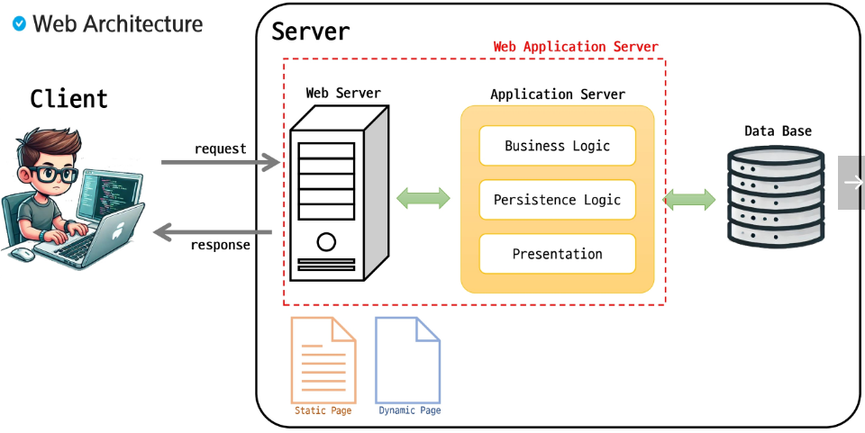

# Web(back)
## Servlet

### 웹 프로그래밍
#### Web Architecture

---

### Servlet
#### Servlet이란?
- Server + Applet의 합성어
- 자바 언어로 작성된 웹 어플리케이션의 서버 측 프로그램
- 자바를 이용하여 웹페이지를 동적으로 생성할 수 있음
- Servlet은 자바코드 안에 HTML을 포함

#### Servlet 생명주기
- Servlet 인스턴스는 웹컨테이너에 의해 제어
- Servlet 인스턴스가 존재하지 않으면 아래의 작업을 수행
    1. Servlet 클래스 로드
    2. Servlet 클래스 인스턴스 생성
    3. Servlet 인스턴스 초기화
    4. 웹 컨테이너에 의한 서비스 메서드 호출
    3. destroy 메서드를 호출하여 Servlet 종료
- 서비스 메서드는 요청이 들어올 때마다 호출

### URI? URL? URN
#### URI
- 통합 자원 식별자
- 인터넷 상의 자원을 고유하게 식별하는 데 사용
- URL과 URN을 포함하는 상위 개념

#### URL
- 통합 자원 위치
- 자원의 위치를 나타내는 데 사용

#### URN
- 통합 자원 이름
- 지원에 대한 고유한 이름을 제공

#### URL 구성요소

#### GET과 POST

#### Servlet 요청과 응답(기존방식)

#### Servlet 요청과 응답(Front Controller)
