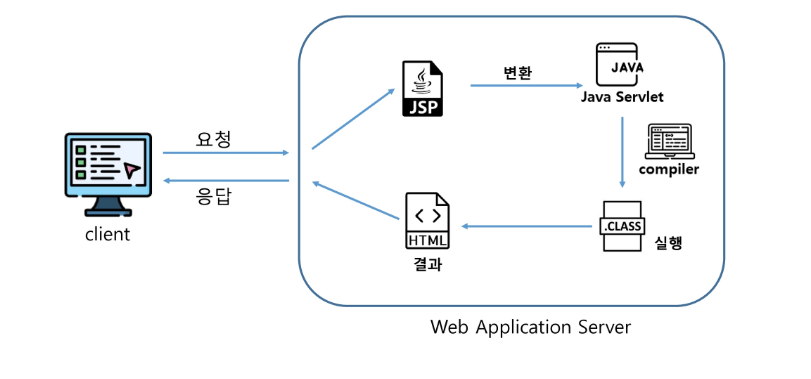
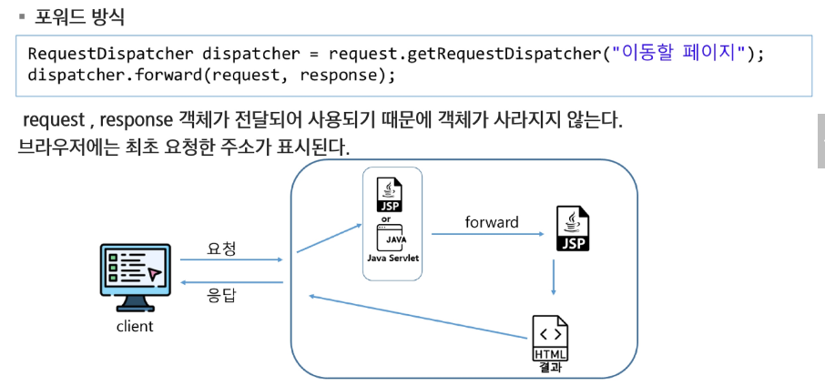
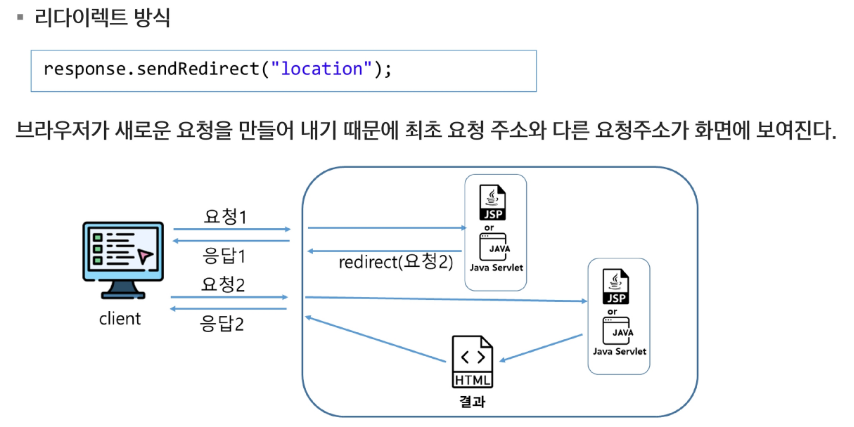

# Web(back)
## JSP
### JSP
- Servlet 표준을 기반으로 작성된 웹 어플리케이션 개발 언어
- HTML 내에 Java를 작성하여 동적으로 웹페이지를 생성하여 브라우저에게 돌려주는 페이지
- 실행 시 Servlet으로 변환된 후 실행

#### JSP 동작

#### JSP 구성요소
- 지시자: JSP에 대한 설정 정보를 지정하기 위해서 사용
- 스크립트 요소: 스크립트릿, 표현식, 선언부 -> JSP에서 문서의 내용을 동적으로 생성하기 위해서 사용
- JSP 기본객체: 요청 및 응답 돤련 정보를 얻거나, 응답 결과를 만들기 위해서 사용
- 표현언어: JSP를 좀 더 간결하게 작성하기 위해서 사용
- Action Tag, JSTL: 자주 사용하는 기능을 모아 미리 정의하여 Tag 형태로 작성한다. JSP에서 자바코드를 쉽게 작성할 수 있도록 사용

#### JSP 태그 종류

#### 스크립트릿
- 스크립트 언어로 작성된 코드 조각을 포함하는데 사용된다.

#### 선언부
- 멤버변수 선언이나 메서드를 선언하는 영역.

#### 표현식
- 변수의 값이나 계산식 혹은 함수를 호출한 결과를 문자열 형태로 웹문서에 출력

#### 주석문
- 작성한 코드에 대한 설명을 기술할 경우 사용
- HTML 주석문과 동일한 기능을 하지만 HTML 주석문은 클라이언트에 보여지고, JSP 주석문은 보여지지 않는다.

#### 지시자
- 웹컨테이너가 JSP 번역하고 실행하는 방법을 서술
- page: 해당 JSP 페이지 전반적으로 환경을 설정할 내용 지정
- include: 현재 페이지에 다른 파일의 내용 삽입할 때 사용
- taglib: 태그 라이브러리에서 태그를 사용할 수 있는 기능 제공

#### 지시자 - page
- JSP 페이지 실행 매개변수를 제어
- 출력처리, 오류처리 등의 내용을 포함

#### 지시자 - include
- JSP 내에 다른 HTML문서나 JSP 페이지의 내용을 삽입할 때 사용한다.
- 반복적으로 사용되는 부분을 별도로 작성하여 페이지 내에 삽입하면 반복되는 코드의 재작성을 줄일 수 있다.

---

### 페이지 이동
요청을 받아서 화면을 변경하는 방법은 두 가지가 있다.
- 포워드 방식
    요청이 들어오면 요청을 받은 JSP 또는 Servlet이 직접 응답을 작성하지 않고, 요청을 서버 내부에서 전달하여 해당 요청을 처리하게 하는 방식
    

- 리다이렉트 방식
    요청이 들어오면 내부 로직 실행 후, 브라우저의 URL을 변경하도록 하여 새로운 요청을 생성함으로써 페이지를 이동한다.
    

