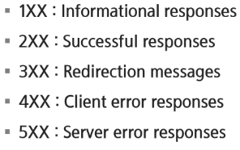
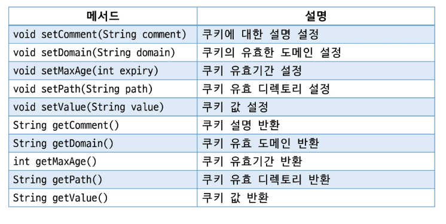
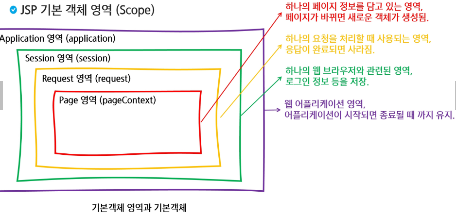
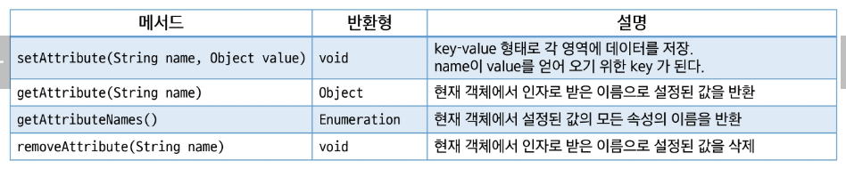
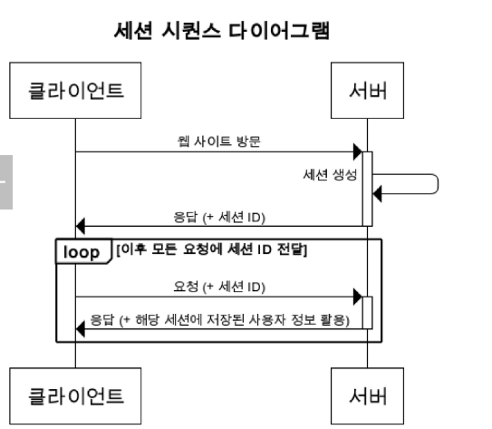
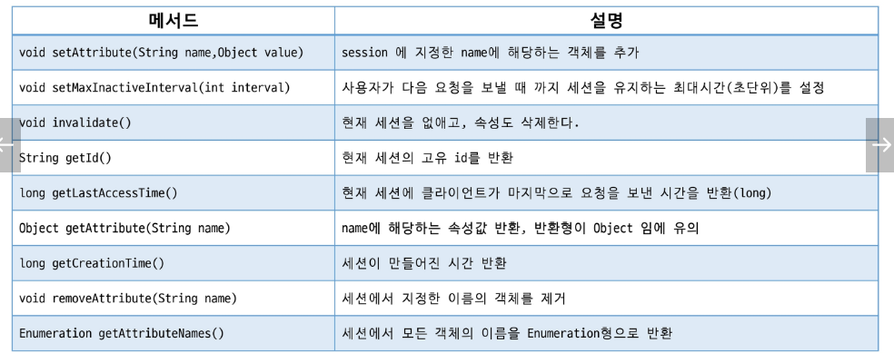

# Web(back)
## Cookie&Session

### HTTP
#### 인터넷 프로토콜
- 인터넷에서 데이터 통신을 위한 표준화된 규약이나 규칙
- TCP
- UDP

#### HTTP
- 웹 서버와 웹 브라우저 간의 통신에 사용
- 다양한 데이터 전송 가능
- 기본 포트번호: 80
- 보안 버전의 HTTPS가 있음 (기본 포트번호: 443)
- 클라이언트 - 서버 구조

#### HTTP 특징
- 비 연결성
    - 지속적인 연결 유지로 인한 자원낭비 방지를 위해 연결 해제
    - 서버의 자원을 효율적으로 사용할 수 있음

- 무상태
    - 서버가 클라이언트의 상태를 저장하지 않음
    - 클라이언트의 상태를 알 수 없기 때문에 추가적인 데이터 전송이 필요함
    - 응답 서버를 쉽게 바꿀 수 있음
    - 브라우저 쿠키 or 서버 세션 등을 이용하여 상태 유지

#### HTTP 상태코드

---

### Cookie
- 웹 서버가 클라이언트의 웹 브라우저에 저장하는 작은 데이터 조각
- 필요에 따라 요청시 서버로 같이 전송
- Key: Value 형태의 문자열 데이터
- 웹 브라우저 별로 별도의 쿠키 생성

#### Cookie 사용 목적
- 세션 관리를 위해 사용
- 사용자가 설정한 환경 등을 기억하여 페이지 제공
- 사용자의 행동과 패턴을 분석
- 사용자의 관심에 따른 광고를 타겟팅하기 위해서 사용

#### Cookie 동작 순서
- Client가 요청 생성
- WAS는 Cookie를 생성하고 HTTP Header에 Cookie를 넣어 응답
- 클라이언트는 쿠키를 저장, 해당 서버에 요청할 때 요청과 함께 쿠키를 전송
- 쿠키는 브라우저가 종료되더라도 계속 저장되기 때문에 동일 사이트 재방문하여 요청시 필요에 따라 쿠키가 재전송됨

#### Cookie 특징
- 이름, 값, 만료일, 도메인경로 등으로 구성된다.
- 클라이언트에 최대 300개의 쿠키를 저장할 수 있다.
- 하나의 도메인당 20개의 쿠키를 저장할 수 있다.
- 쿠키 하나당 4KB 제한

#### Cookie 주요 메서드

---

### JSP 기본 객체 영역

#### JSP 기본 객체 영역 메서드
- servlet과 페이지간 정보를 공유하기 위해서 메서드를 지원한다.

---

### Session
- 사용자가 웹 서버에 접속해 있는 상태를 하나의 단위보고 세션이라고 한다.
- 각 세션은 sessionid를 이용해 구분한다.
- WAS의 메모리에 객체 형태로 저장
- 메모리가 허용하는 용량까지 제한없이 저장 갖능
- 쿠키는 클라이언트에 저장되기 때문에 공유 PC의 경우 보안에 취약할 수 있다. 하지만 세션은 서버에 저장되기 때문에 쿠키에 비해 보안이 좋다.
- 사용자 정보 및 장바구니 등에 사용한다.

#### session 동작 순서
- 클라이언트가 페이지를 요청
- 서버는 쿠키에 session id가 있는지 확인한다.
- session id가 존재하지 않으면 session id를 생성해 쿠키에 쓴 다음 클라이언트로 반환
- 생성된 session id를 이용하여 서버 내 메모리를 생성
- 클라이언트가 다음 요청 시 쿠키에 session id를 포함해 전달하면 서버 내에 저장된 session id와 비교하여 데이터를 조회

#### HTTPSession 주요 메서드
