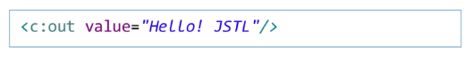

# Web(back)
## JSTL&EL

### JSP 5가지
1. <% %>: 자바코드
2. <%! %>: 함수/변수 -> 클래스 영역
3. <%= %>: 표현식
4. <%-- --%>: 주석 -> 서블릿 변환x
5. <%@ %>: 지시자 -> page, include, taglib

---

### EL(Expression Language)
- EL 표현식은 JSP 내에 데이터를 다루는 데 사용되는 스크립팅 언어
- JSP 스크립트 표현식을 대신하여 속성값을 쉽게 출력할 수 있도록 고안된 언어

- ${}: 변수, 속성, 메서드 호출 등을 포함할 수 있음

#### JavaBeans
- Java로 작성된 재사용 가능한 소프트웨어 컴포넌트
- 관례
    - 클래스는 직렬화되어야 한다
    - 클래스는 기본 생성자를 가지고 있어야 한다
    - 클래스의 속성들은 getter, setter를 사용해 접근할 수 있어야 한다
    - 클래스는 필요한 이벤트 처리 메서드들을 포함하고 있어야 한다

- EL 표현식을 이용하여 접근이 가능하다
    - .(dot) 혹은 ["속성명"]을 사용할 수 있다.
    - 인스턴스만을 작성하면 toString() 메서드가 동작한다.

#### 연산자

- EL 식은 연산자를 포함할 수 있으며, 산술 연산, 조건 연산, 논리 연산, 관계 연산을 수행할 수 있다
- 일반적인 연산 이외에 null 연산을 수행할 수 있다
- empty 연산자는 검사할 객체가 null인지 아닌지 검사하기 위해서 사용된다.

#### EL 내장 객체

---

### JSTL(JSP Standard Tag Library)
- JavaEE 기반의 웹 어플리케이션 개발을 위한 컴포넌트 모음
- JSP 스크립ㅇ트와 html 코드가 섞여서 복잡한 구조를 가짐 -> 이를 간결하게 작성하기 위해서 자바코드를 태그 형태로 작성해 놓은 것
- 유용한 커승텀 태그들을 모아서 표준화한 것

#### JSTL 기능
- 간단한 프로그램 로직 구현 기능 - 변수 선언, if 문장, for문 등

#### JSTL 사용하기
- taglib 지시자를 이용한 태그 사용 선언

- 사용하고자 하는 기능에 따라 어떤 라이브러리를 사용할지 작성한다.
- 사용할 태그를 구분하기 위해서 prefix를 작성해준다

- prefix에 작성한 접두사를 적어주고, 기능에 따른 태그를 선택하여 작성한다

#### JSTL - Core
