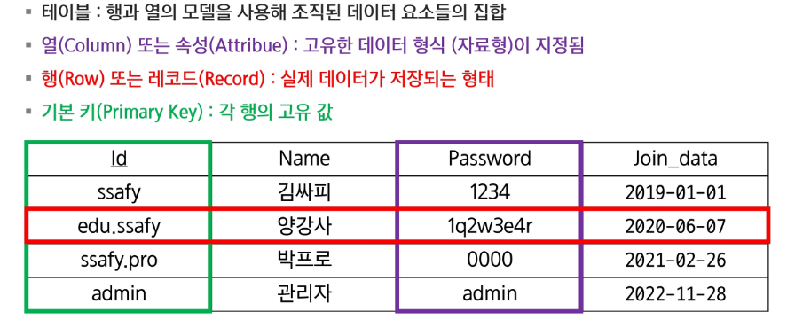
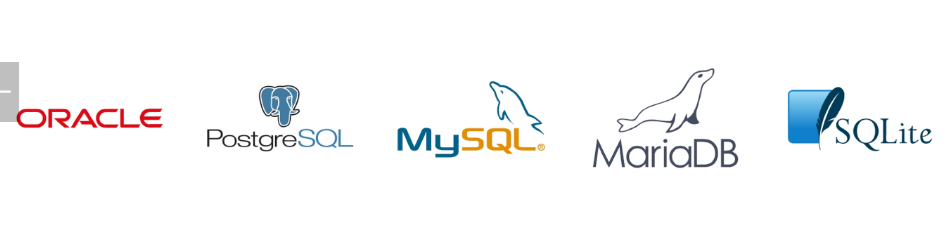
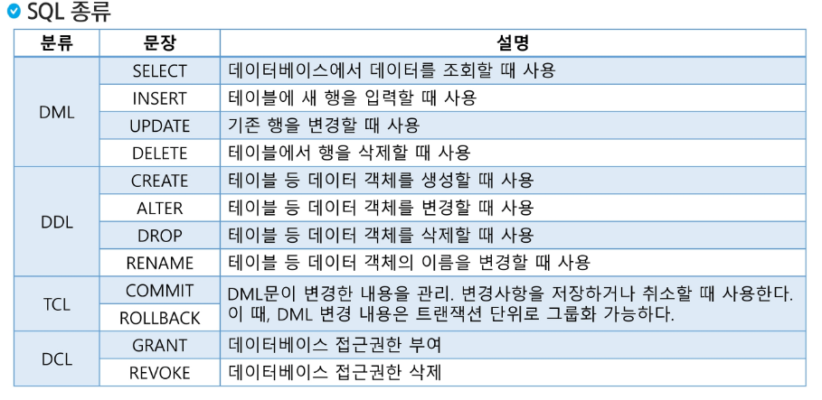
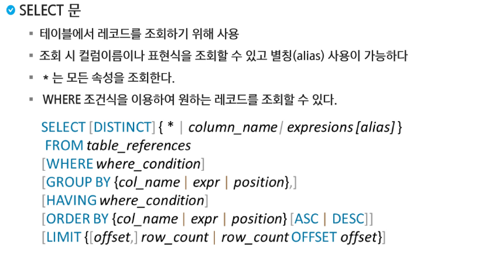
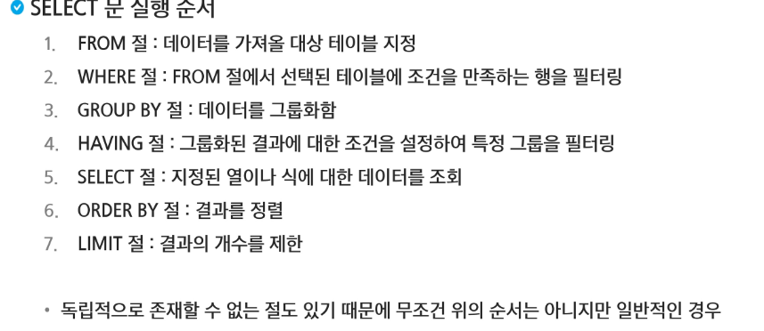

# DB
## Select

### 데이터베이스
#### 데이터베이스란?
- 여러 사람이 공유하고 사용할 목적으로 통합 관리되는 정보의 집합
- 논리적으로 연관된 하나 이상의 자료의 모음
- 데이터들을 고도로 구조화 함으로써 검색과 갱신의 효율화를 꾀한 것
- 몇개의 자료 파일을 조직적으로 통합하여 중복을 없애고 자료를 구조화 시킨 자료의 집합체

- 통합된 데이터
- 저장된 데이터
- 운영데이터
- 공용데이터
조직 또는 개인이 필요에 의해 논리적으로 연관된 데이터를 모아 일정한 형태로 저장한 것

#### DBMS
데이터베이스 관리 프로그램
- 데이터베이스 조작 인터페이스 제공
- 효율적은 데이터 관리 기능제공
- 데이터 복구, 사용자 권한부여, 유지보수 기능제공

---

### 관계형 데이터베이스
- 테이블 기반의 데이터베이스
- 테이블
    - 실제 데이터가 저장되는 곳
    - 행과 열의 2차원 구조를 가진 데이터 저장소
- 데이터를 테이블 단위로 관리
    - 하나의 데이터는 여러 속성을 가진다
    - 데이터 중복을 최소화
    - 테이블 간의 관계를 이용하여 필요한 데이터 검색 가능

#### 관계형 데이터베이스 테이블 구조
- 스키마: 데이터베이스에서 자료의 구조, 표현방법, 관계 등 전반적인 명세를 기술한 것

#### 관계형 데이터베이스 관리 시스템

---

### SQL
- 관계형 데이터베이스에서 데이터 조작과 데이터 정의를 위해 사용하는 언어
    - 데이터 조회
    - 데이터 삽입, 삭제, 수정
    - DB Object 생성 및 변경, 삭제
    - DB 사용자 생성 및 삭제, 권한 제어
- 표준 SQL은 모든 DBMS에서 사용 가능

#### SQL 특징
- 배우고 사용하기 쉽다
- 대소문자를 구별하지 않는다
- 절차적인 언이가 아니라 선언적 언어이다
- DBMS에 종속적이지 않다

#### DML: 데이터 조작 언어
#### DDL: 데이터 정의 언어
#### DCL: 데이터 제어 언어
#### TCL: 트랜잭션 언어

---

### SELCT

