# DB
## DDL, DML

### 자료형
#### 숫자 자료형
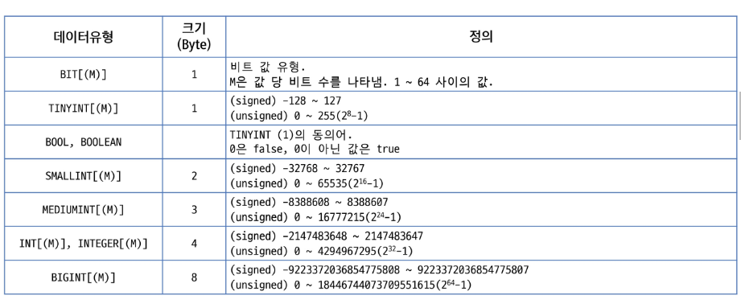

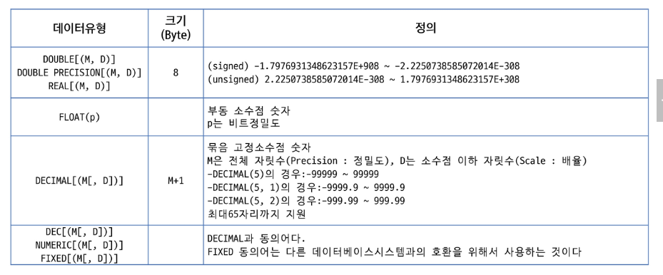

#### 문자 자료형
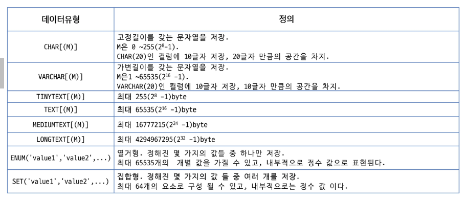

#### 날짜 자료형
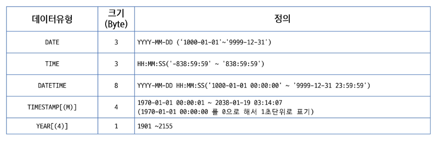

#### BINARY 타입
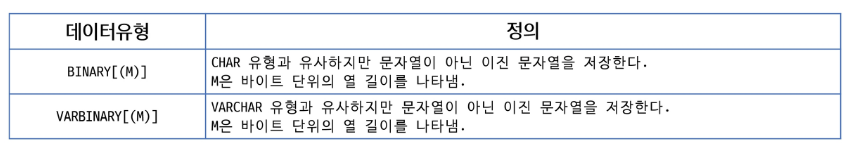

#### BLOB 타입
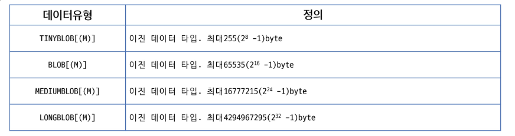

---

### DDL
#### 데이터베이스 생성하기
`CREATE DATABASE databasename`

#### 테이블 생성하기
`CREATE TABLE table_name`

#### 제약조건
- 컬럼에 저장될 데이터의 조건을 설정
- 제약조건에 위배되는 데이터는 저장 불가
- 테이블 생성시 컬럼에 지정하거나, constraint로 지정가능(ALTER)
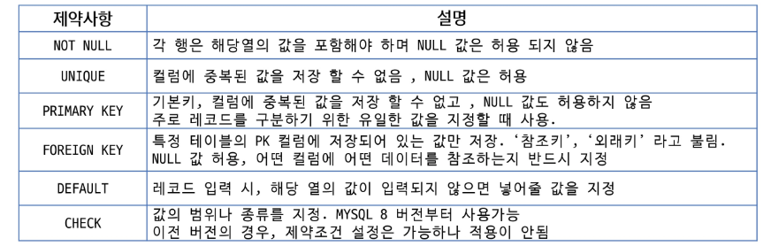

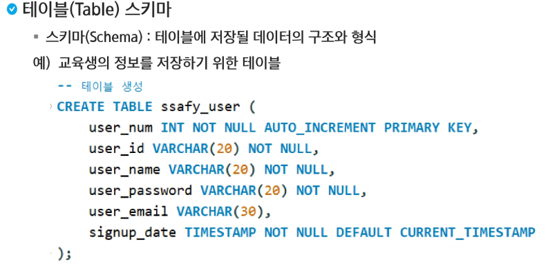

---

### DML
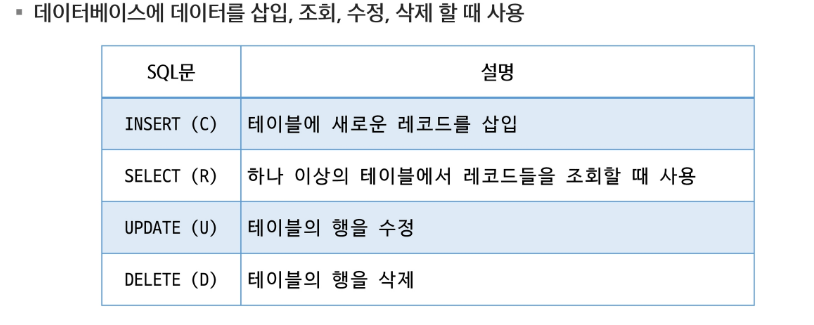

---

### MySQL Functions
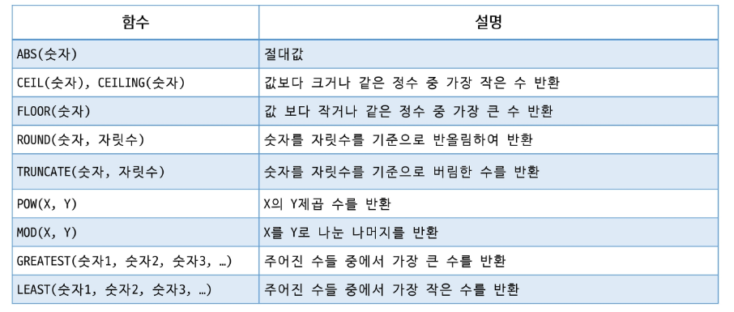

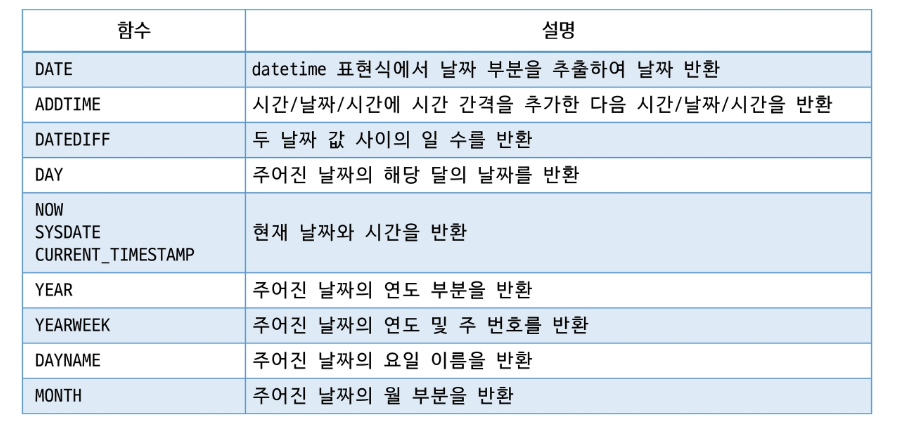

---

### 트랜잭션
- 커밋: 트랙잭션을 종료하여 변경사항에 대해서 영구적으로 저장하는 SQL
- 롤백: 트랜잭션에 의해 수행된 모든 변경사항을 실행 취소하는 SQL
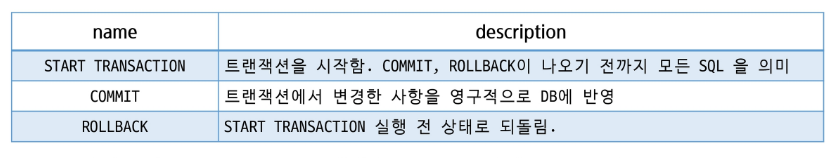
- MySQL에서는 기본이 Auto Commit 상태