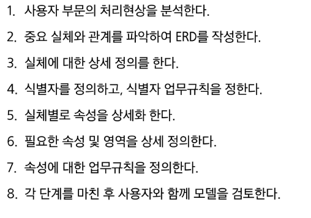
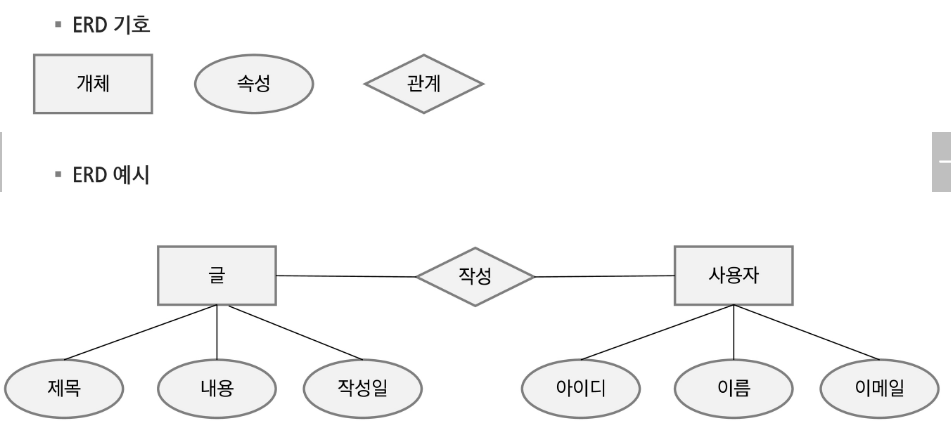
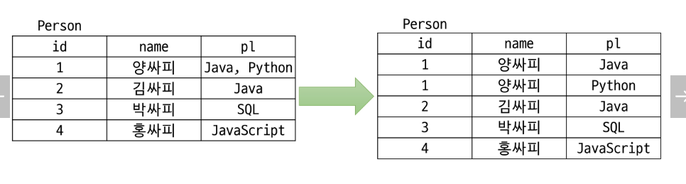
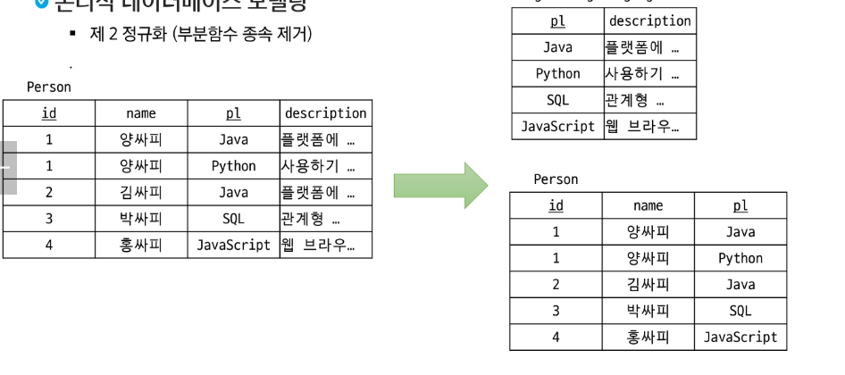
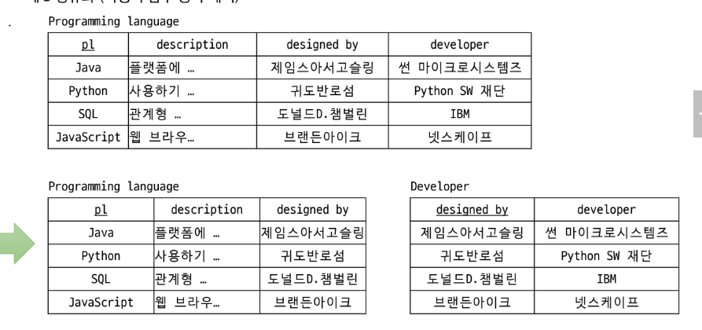

# DB
## Join & SubQuery,DB 모델링

### JOIN
- 둘 이상의 테이블에서 데이터를 조회하기 위해서 사용
- 일반적으로 조인 조건은 PK 및 FK로 구성
- PK 및 FK 관계가 없더라도 논리적인 연관만으로 JOIN 가능
- JOIN의 종류
    - INNER JOIN: 조인 조건에 해당하는 칼럼 값이 양쪽 테이블에 모두 존재하는 경우에만 조회
    동등 조인이라고도 한다. N개의 테이블 조인 시 N-1개의 조인 조건이 필요

    - OUTER JOIN: 조인 조건에 해당하는 칼럽 값이 한 쪽 테이블에만 존재하더라도 조회 기준 테이블에 따라 LEFT OUTER JOIN, RIGHT OUTER JOIN으로 구분

#### 카타시안 곱
- 두 개 이상의 테이블에서 데이터를 조회할 때
    - 조인 조건을 지정하지 않음
    - 조인 조건이 부적합함

#### OUTER JOIN
- 두 테이블에서 하나의 테이블에 조인조건 데이터가 존재하지 않더라도 데이터를 조회하기 위해서 사용

#### 셀프 조인
- 같은 테이블 2개를 조인
- 모든 사원의 이름, 매니저번호, 매니저 이름 조회

#### 비 동등 조인
- 조인조건이 table의 PK, FK 등으로 정확히 일치하는 것이 아닐 때 사용

---

### 서브쿼리
#### 서브쿼리란?
- 서브쿼리란 하나의 SQL문 안에 포함되어 있는 SQL문을 의미
- 서브쿼리를 포함하는 SQL을 외부 쿼리 또는 메인 쿼리라고 부르며, 서브 쿼리는 내부 쿼리라고도 부름

#### 서브쿼리의 종류
- 중첩 서브 쿼리
- 인라인 뷰
- 스칼라 서브 쿼리

---

### 모델링
#### DataBase Modelling

#### 개념적 데이터베이스 모델링
- 식별자: 한 개체 내에서 인스턴스를 구분할 수 있는 단일 속성 또는 속성 그룹
- 후보키: 각각의 인스턴스를 구분할 수 있는 속성
- 기본키: 개체에서 각 인스턴스를 유일하게 식별하는데 적합한 키
- 대체키: 후보키 중 기본키로 선정되지 않은 키
- 복합키: 하나의 속성으로 기본키가 될 수 없는 경우 둘 이상의 칼럼을 묶어서 식별자로 정의
- 대리키: 식별자가 너무 길거나 여러개의 속성으로 구성되어 있는 경우 인위적으로 추가

#### 논리적 데이터베이스 모델링
- 정규화
    - 관계형 데이터베이스 설계에서 중복을 최소화하게 데이터를 구조화하는 프로세스를 말함

- 정규화의 목적
    - 데이터베이스 변경 시 이상현상 제거

- 제 1 정규화

- 제 2 정규화

- 제 3 정규화

#### 물리적 데이터베이스 모델링
- 논리적 데이터베이스 모델링 단계에서 얻어진 데이터베이스 스키마를 좀 더 효율적으로 구현하기 위한 작업

- 역정규화
    - 시스템 성능을 고려하여 기존 설계를 재구성하는 것
    - 정규화에 위배
    - 데이블 재구성