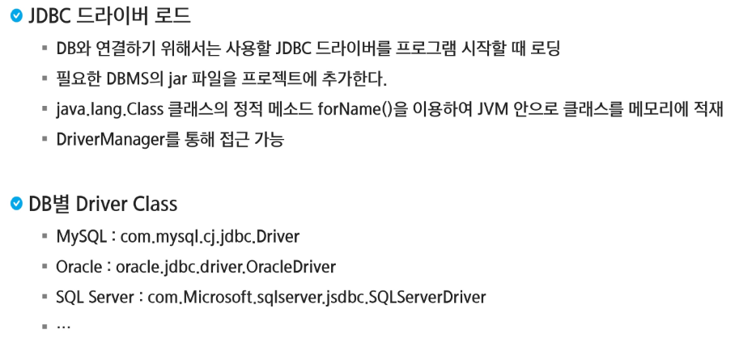
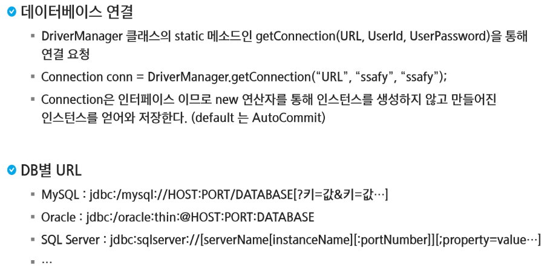
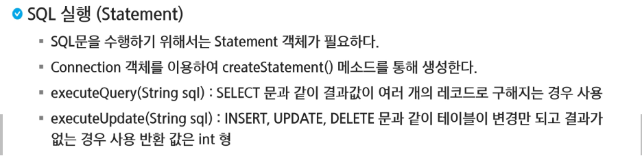
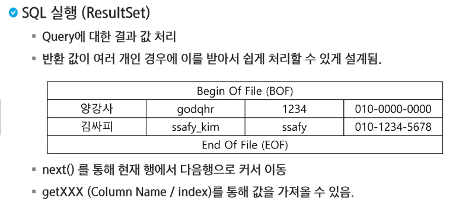
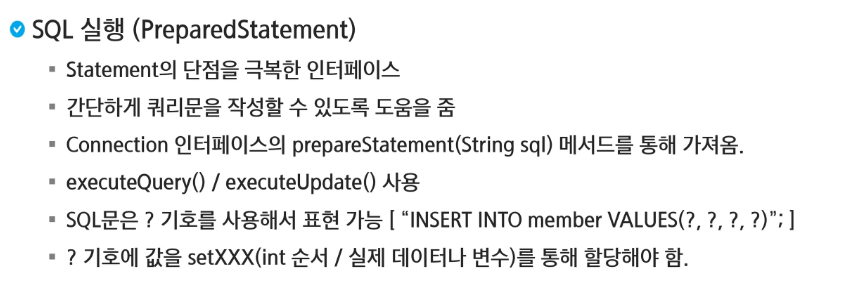

# DB
## JDBC

#### JDBC란?
- Java 프로그램에서 DB에 일관된 방식으로 접근할 수 있도록 API를 제공하는 클래스의 집합
- 데이터베이스에서 자료를 쿼리하거나 업데이트하는 방법을 제공
- Java에서는 JDBC를 이용하여 SQL을 DBMS와 주고받음
- DBMS의 종류에 관계없이 사용 가능

#### JDBC 이용하여 DB 연결하는 방법
1. JDBC 드라이버 로드
2. 데이터베이스 연결
3. SQL문 실행
4. 데이터베이스 연결 끊음

