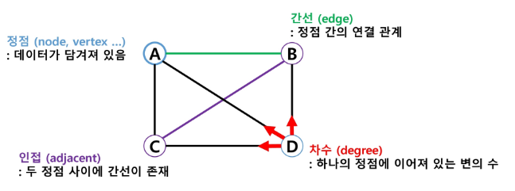
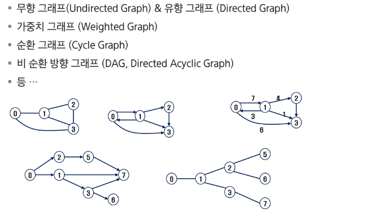
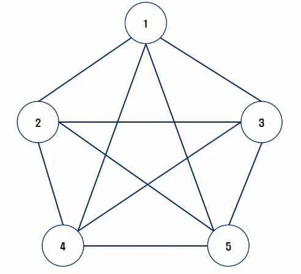
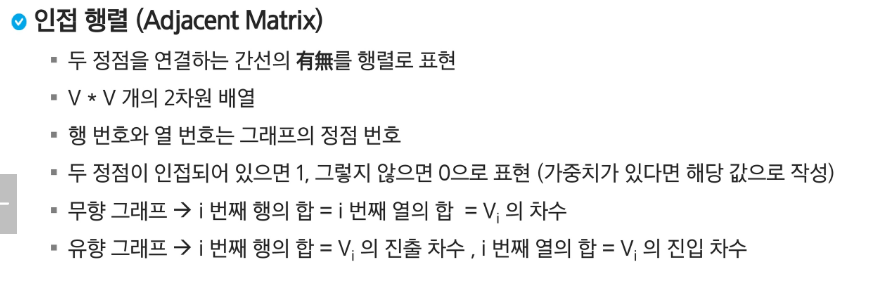
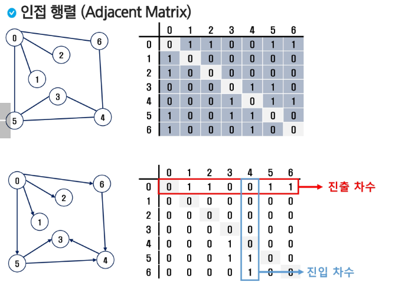
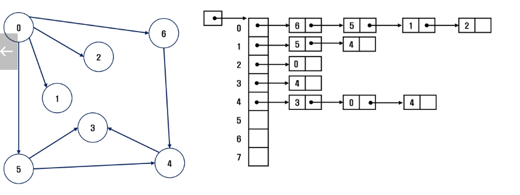
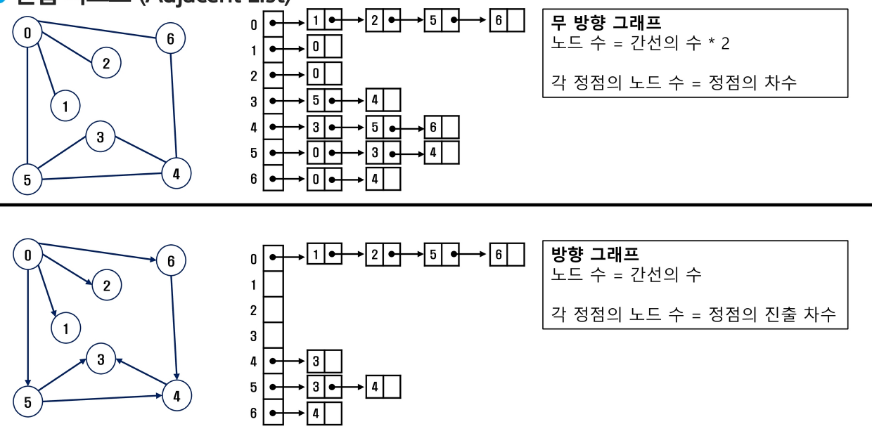
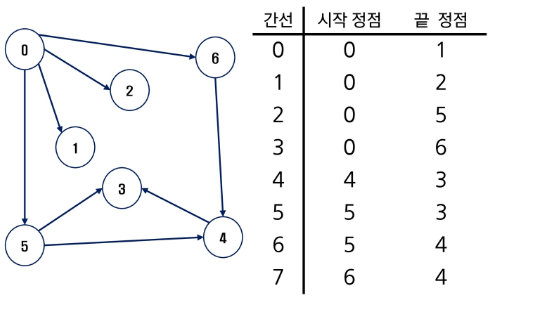

# APS
## 그래프

### 자료구조
- 배열
- 문자열
- 스택
- 큐
- 연결리스트
- 트리
- 힙

---

### 그래프
- 아이템들과 이들 사이의 연결 관계 표현
- 정점들의 집합과 이들을 연결하는 간선들의 집합으로 구성된 자료구조
- 선형자료구조나 트리로 표현하기 어려운 M:N의 관계를 표현한 것
- V개의 정점을 가지는 그래프는 최대 V * (V - 1) / 2 간선이 가능

#### 그래프 종류

#### 완전 그래프 & 부분 그래프
- 정점들에 대해 가능한 모든 간선들을 가진 그래프
- 일부 간선들을 가진 그래프

#### 경로
- 간선들을 순서대로 나열한 것
- 하나의 정점을 한번만 지나는 경로를 단순 경로라고 한다
- 시작 정점에서 끝나는 경로를 사이클이라고 한다

---

### 그래프 표현 방법
- 간선의 정보를 저장하는 방식
1. 인접행렬
2. 인접리스트
3. 간선배열

#### 인접 행렬

#### 인접 리스트
- 각 정점에 대한 인접 정점들을 순차적으로 표현
- 하나의 정점에 대한 인접 정점들을 각 노드로 하는 연결리스트로 저장

#### 간선 배열
- 정점과 정점의 연결 정보인 간선을 배열에 저장
- 간선을 표현하는 두 정점의 정보를 배열 혹은 객체로 저장할 수 있음

