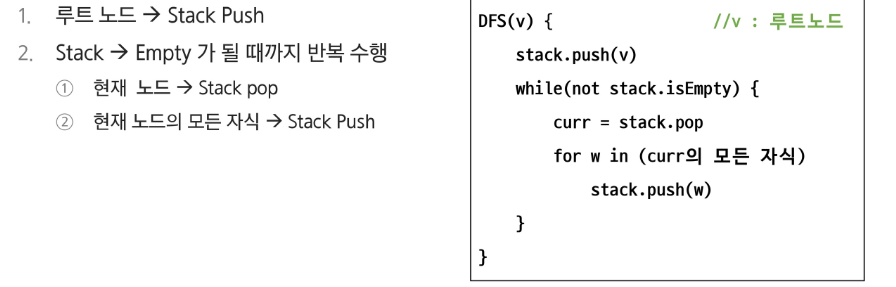

# APS
## 그래프 탐색1

### 그래프 탐색

#### 모든 노드를 빠짐없이 탐색하는 방법
1. 깊이 우선 탐색
2. 너비 우선 탐색

#### DFS
- 깊이 우선 탐색
- 시작 지점에서 출발하여 한 방향으로 탐색
- 진행할 수 없다면 마지막에 만난 지점으로 돌아와 다른 방향 다시 탐색
- 후입선출 구조의 스택 사용
- 재귀함수는 System Stack을 활용하므로 간단하게 구현 가능

#### 트리 탐색

#### 트리탐색 (재귀 함수)
