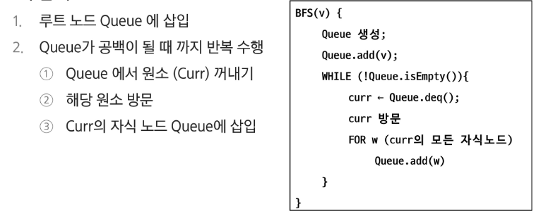
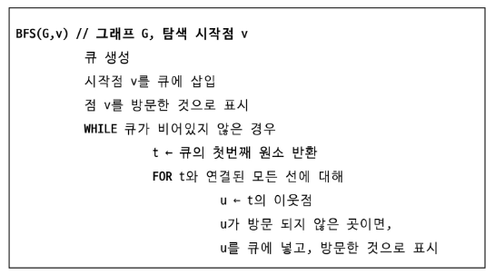

# APS
## 그래프탐색1

### BFS
- 너비 우선 탐색
- 시작 지점에 인접한 순으로 탐색을 시작함
- 인접한 지점을 모두 방문하였다면 다음으로 인접한 지점을 방문함
- 선입선출 구조의 Queue 자료구조를 사용
- 너비 우선 탐색은 시작 지점과 끝 지점이 주어졌을 때 최단 길이를 구할 수 있음

#### 트리 탐색

#### 그래프 탐색

