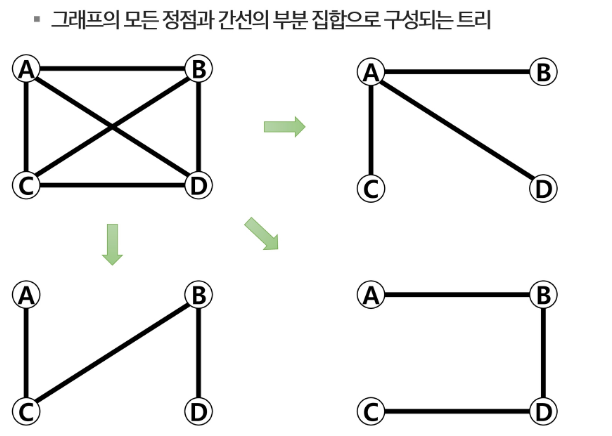

# APS
## 그래프최소비용1

### 서로소 집합
#### 상호 배타 집합
- 중복 포함된 원소가 없는 집합 -> 교집합이 없음
- 각 집합은 대표자를 통해 구분

#### 상호 배타 집합 표현 방법
- 연결 리스트
- 트리

#### 상호 배타 집합 연산
- Make-Set(x)
- Find-Set(x)
- Union(x, a)

#### 상호 배타 집합 표현 - 연결리스트
- 같은 집합의 원소들은 하나의 연결리스트로 관리
- 연결리스트의 맨 앞의 원소를 집합의 대표자로 결정
- 각 원소는 집합의 대표원소를 가리키는 링크를 갖는다

#### 상호 배타 집합 표현 - 트리
- 하나의 집합을 하나의 트리로 표현한다
- 자식 노드가 부모 노드를 가리키며 루트 노드가 대표자가 된다

#### 연산의 효율을 높이는 방법
- Rank를 이용한 Union
- Path Compression

---

### 최소 비용 신장 트리
#### 신장 트리

#### 최소 신장 트리
- 신장 트리 중엡서 사용된 간선들의 가중치 합이 최소인 트리
- 무 방향 가중치 그래프
- N개의 정점을 가지는 그래프에 대해 반드시 (N - 1)개의 간선을 사용
- 사이클을 포함 x

---

### KRUSKAL Algorithm
#### 크루스칼 알고리즘
1. 최초, 모든 간선을 가중치에 따라 오름차순으로 정렬
2. 가중치가 가장 낮은 간선부터 선택하면서 트리를 증가시킴 -> 사이클이 존재하면 다음으로 가중치가 낮은 간선 선택
3. N-1 개의 간선이 선택될 때까지 2 반복

