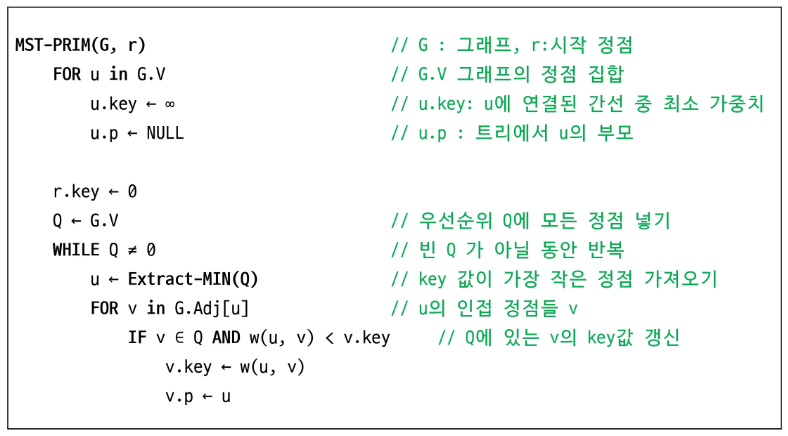
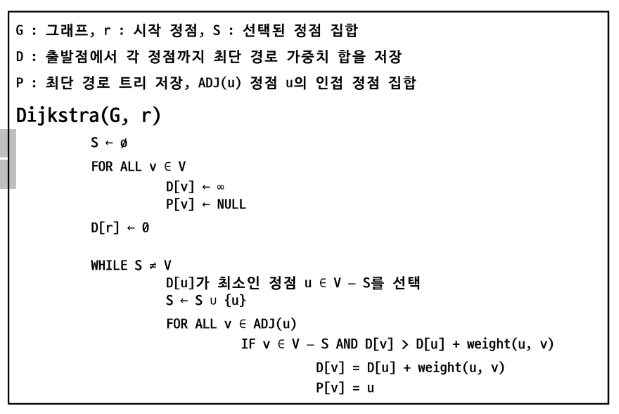

# APS
## 그래프최소비용2

### 프림 알고리즘
- 하나의 정점에서 연결된 간선들 중에 하나씩 선택하면서 MST를 만들어가는 방식
1. 임의 정점을 선택하여 시작
2. 선택한 정점과 인접하는 정점들 중의 최소 비용의 간선이 존재하는 정점을 선택
3. 모든 정점이 선택될 때까지 2과정을 반복

- 서로소인 2개의 집합 정보를 유지
    - 트리 정점: MST를 만들기 위해 선택된 정점들
    - 비트리 정점들: 선택되지 않은 정점들

#### 프림 알고리즘 의사코드

---

### 다익스트라 알고리즘
#### 최단 경로 정의
- 가중치가 있는 그래피에서 두 정점 사이의 경로들 중 간선의 가중치의 합이 최소인 경로

#### 하나의 시작 정점에서 끝 정점까지의 최단 경로
- 다익스트라 알고리즘(음의 가중치 허용x)
- 벨만-포드 알고리즘(음의 가중치 허용o)

#### 모든 정점들에 대한 경로
- 플로이드-워셜 알고리즘

#### 다익스트라 알고리즘
- 시작 정점에서 거리가 최소인 정점을 선택해 나가면서 최단 경로를 구하는 방식
- 탐욕 알고리즘 중 하나이고, 프림 알고리즘과 유사함
- 정점 A에서 정점 B까지의 최단 경로 (A -> X + X -> B)

#### 다익스트라 알고리즘 동작 과정
1. 시작 정점 입력
2. 거리 저장 배열을 무한대로 초기화
3. 시작점에서 갈 수 있는 곳의 값 갱신
4. 아직 방문하지 않은 점들이 가지고 있는 거리 값과 현재 정점에서 방문하지 않은 정점까지의 가중치의 합이 작다면 갱신
5. 모든 정점을 방문할 때까지 반복

#### 다익스트라 의사코드

