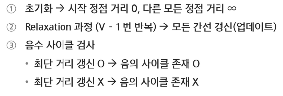
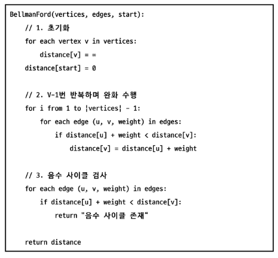
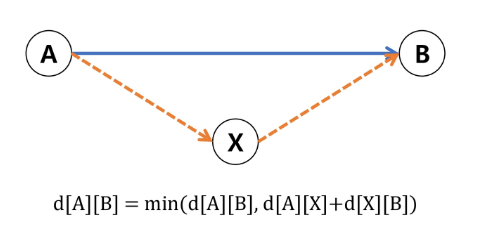
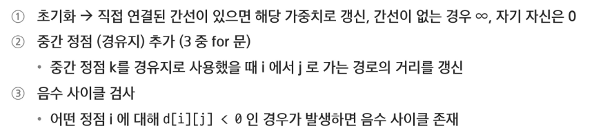
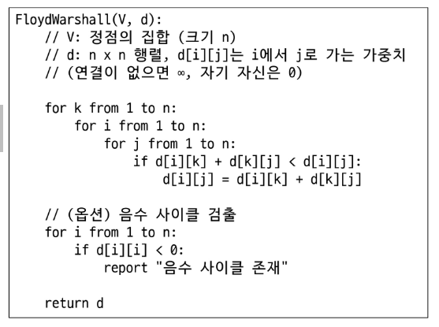
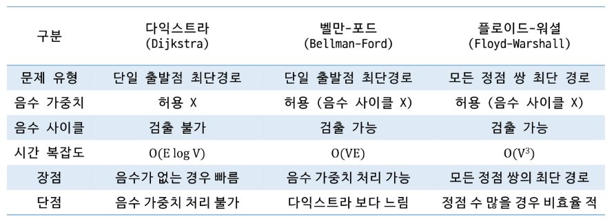

# APS
## 그래프최소비용3

#### 벨만 포드 알고리즘
- 단일 출발점 최단 경로 문제를 해결할 수 있음
- 음의 가중치를 포함하는 그래프에서 최단 경로 구할 수 있음
- 음수 사이클 탐지 가능 -> 최단 경로가 '무한대로 줄어드는 경우' 방지
- 모든 간선을 순회하면서 알려진 최단 경로보다 더 짧은 경로가 있다면 값을 갱신하는 과정을 진행함
- 시간 복잡도 O(VE) // V 정점의 수:, E: 간선의 수

#### 벨만 포드 알고리즘 동작 과정

#### 벨만 포드 알고리즘 의사코드

---

### 플로이드 워셜 알고리즘
- 모든 정점 쌍에 대한 최단 경로 -> 단일 출발점 X / 모든 정점 쌍에 대한 최단 경로 계산
- 음의 가중치를 포함하는 그래프에서 최단 경로 구할 수 있음(단, 음의 사이클X)
- 경유지를 하나씩 추가하면서, 각 정점 쌍의 경로를 점진적으로 개선함
- 시간 복잡도 O(V^3) // V: 정점의 수

#### 플로이드 워셜 알고리즘 동작과정

#### 플로이드 워셜 알고리즘 의사코드

---

### 최단 경로 알고리즘 비교 분석
