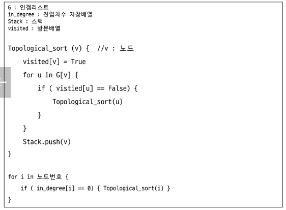

# APS
## 그래프응용

### 위상 정렬
- 순서가 있는 작업을 차례로 진행해야 할 떄 순서를 결정해 주기 위해 사용하는 알고리즘
- 사이클 없는 방향 그래프의 모든 노드를 주어진 방향성에 어긋나지 않게 순서를 나열하는 것

#### 위상 정렬 방법(Queue 사용)
1) 진입 차수가 0인 모든 노드를 큐에 삽입
2) 큐가 공백 상태가 될 때까지 반복 수행
    1. 큐에서 원소를 꺼내 해당 노드에서 나가는 간선을 그래프에서 제거한다.
    2. 새롭게 진입 차수가 0이 된 노드를 큐에 삽입한다.

#### 위상 정렬 (Stack 사용)
1) 진입 차수가 0인 모든 노드에서 DFS 탐색 수행
2) DFS 수행
    1. 해당 노드를 방문 표시
    2. 인접하면서 방문하지 않은 노드가 있다면 DFS 재귀 호출
    3. 함수 리턴하기 전 Stack에 현재 노드 저장
3) Stack이 공백 상태가 될 때까지 pop

#### 위상 정렬 특징
- 모든 정점을 방문하기 전에 큐가 공백 상태가 되면 사이클이 존재하는 것이다
- 그래프의 유형은 DAG
- 여러 해답이 존재할 수 있다
- 시간 복잡도 O(V + E)

