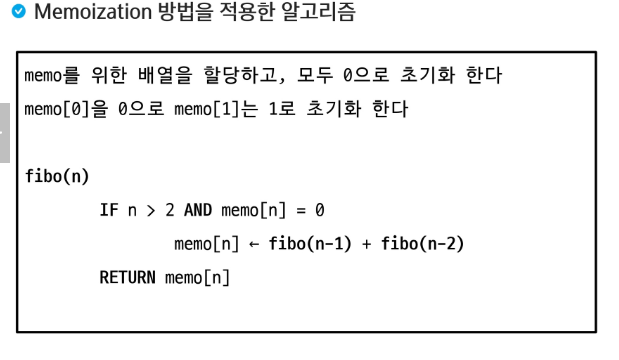
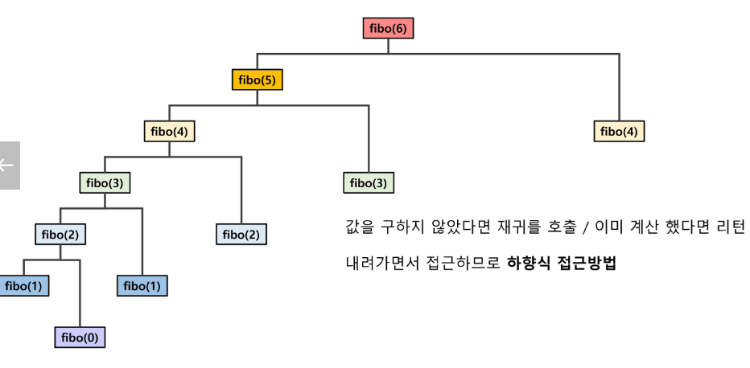
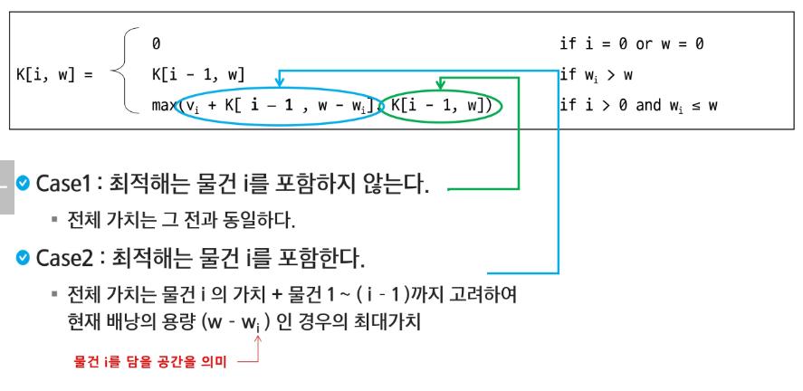
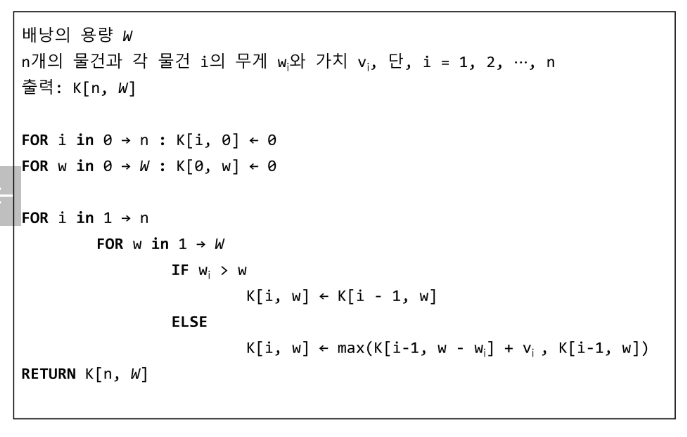

# APS
## 동적계획법

### Memoization
- 메모이제이션은 컴퓨터 프로그램을 실행할 때, 이전에 계산한 값을 메모리에 저장해서 매번 다시 계산하지 않도록 하여 전체적인 실행속도를 빠르게 하는 기술이다.
- 동적 계획법의 핵심이 되는 기술이다.
- 'Memoization'은 글자 그대로 해석하면 메모링에 넣기라는 의미이며 '기억되어야 할 것'이라는 뜻의 라틴어에서 파생되었다.

---

### 동적 계획 알고리즘
- 그리디 알고리즘과 같이 최적화 문제를 해결하는 알고리즘이다.
- 최적화 문제: 최적 값을 구하는 문제 
    - 해당 문제에 여러 해가 있을 수 있다
    - 특정한 최적해를 구하는 것이 아니라 어떤 최적해를 구하는 것이다.
- 동적 계획 알고리즘은 먼저 작은 부분 문제들의 해들을 구하고, 이들을 이용하여 보다 큰 크이의 부분 문제들을 해결하여 최종적으로 원래 주어진 문제를 해결하는 알고리즘 설계 기법이다.

#### 중복 부분문제 구조
- DP는 큰 문제를 이루는 작은 문제들을 먼저 해결하고, 작은 문제들의 최적 해를 이용하여 순환적으로 큰 문제를 해결한다
    - 순환적인 관계를 명시적으로 표현하기 위해서 동적 계획법에서는 일반적으로 수학적 도구인 점화식을 사용한다.
- DP는 문제의 순환적인 성질 때문에 이전에 계산되어졌던 작은 문제의 해가 다른 어딘가에서 필요하게 되는데 이를 위해 DP에서는 이미 해결된 작은 문제들의 해들을 어떤 저장공간에 저장하게 된다.
- 그리고 이렇게 저장된 해들이 다시 필요할 떄마다 해를 얻기 위해 다시 문제를 재계산하지 않고 table의 참조를 통해서 중복된 계산을 피하게 된다.

#### 최적 부분문제 구조
- 동적 계획법이 최적화에 대한 어느 문제에나 적용될 수 있는 것은 아니다.
- 주어진 문제가 최적화의 원칙을 만족해야만 동적 계획법을 효율적으로 적용
- 최적화의 원칙이란 어떤 문제에 대한 해가 최적일 때 그 해를 구성하는 작은 문제들의 해 역시 최적이어야 한다는 것이다
- 동적 계획법의 방법 자체가 큰 문제의 최적해를 작은 문제들의 최적해들로 구성되지 않는다면 이 문제는 동적 계획법을 적용할 수 없다.

---

### Knapsack

