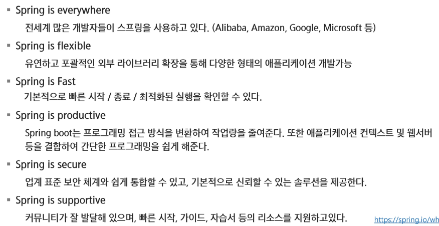
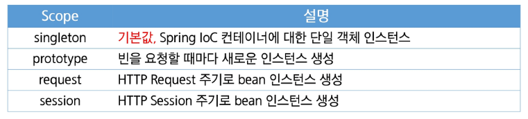
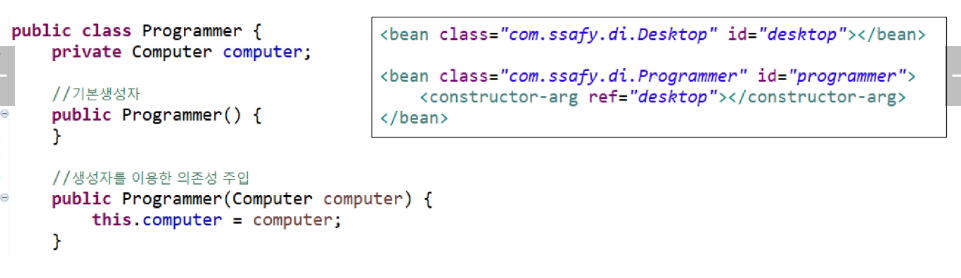
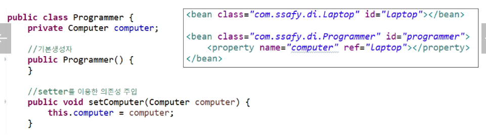
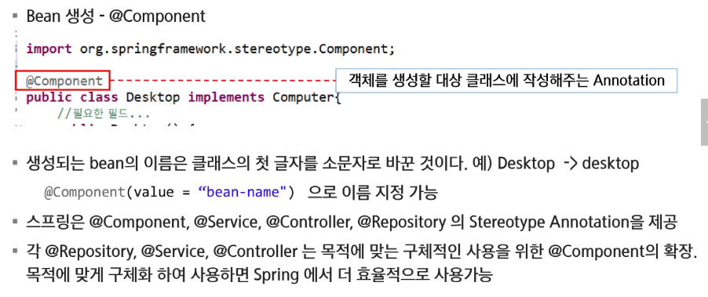
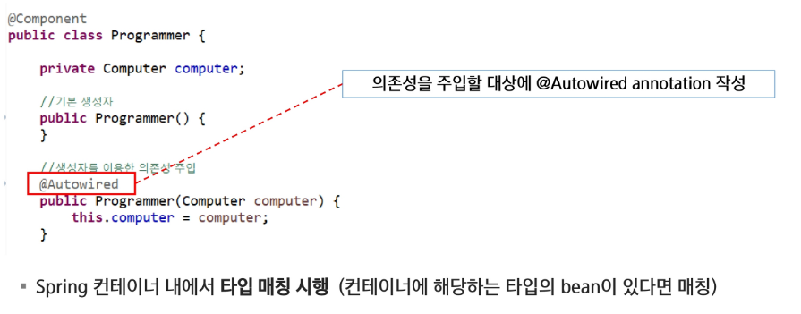
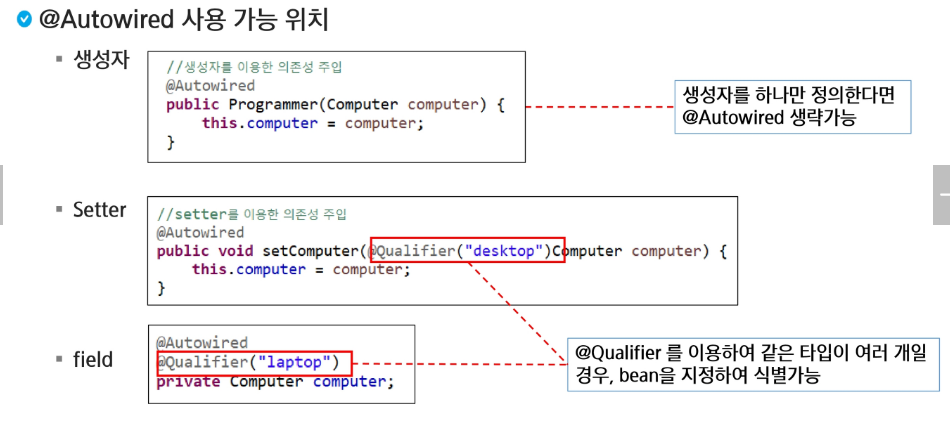

# Spring

## DI

### Spring Framework

#### Framework

- 사전적 의미: 뼈대, 틀
- SW에서의 의미: SW 특정 문제를 해결하기 위해섯 상호 협력하는 클래스와 인터페이스의 집합

#### Framework 왜 사용하는가?

- 웹 어플리케이션을 개발하기 위해서는 많은 기본 기능을 설계, 작성해야 한다.
- 공통으로 사용되는 기본 기능들을 일관되게 사용할 수 있으면 개발자는 웹 어플리케이션 기능 자체 개발에만 신경을 쓰면 되기 때문에 생산성이 높아진다.
- 개발자 입장에서는 완성된 구조에 맡은 기능을 개발하여 넣어주면 되기 때문에 개발 기간을 단축할 수 있다.

#### 왜 Spring Framework를 사용해야 하는가?

---

### 의존관계 역전

- Class A 객체가 어떤 일을 처리하기 위해서 Class B의 객체의 도움을 받아야만 일을 처리할 수 있다면 `Class A는 Class B에 의존한다`라고 표현

---

### 의존성 주입

- 생성자 이용
- 설정자 이용
- 메서드 이용
- Factory

---

### Spring Container Build

#### Spring IoC Container

- Container?

  - 스프링에서 핵심적인 역할을 하는 객체를 Bean이라고 하며, Container는 Bean의 인스턴스화 조립, 관리의 역하르 사용 소멸에 대한 처리를 담당한다.

  - BranFactory

    - 프레임워크 설정과 기본 기능을 제공하는 컨테이너
    - 모든 유형의 객체를 관리할 수 있는 매커니즘

  - ApplicationContext

    - BeanFactory 하위 인터페이스
    - 이벤트 처리, 국제화용 메시지 처리 등 다양한 기능 제공

  - WebApplicationContext
    - 웹 환경에서 Spring을 상요하기 위한 기능이 추가됨
    - 대표적인 구현 클래스로 XmlWebApplicationContext가 있음

#### 스프링 설정 정보

- 애플리케이션 작성을 위해 생성할 Bean과 설정 정보, 의존성 등의 방법을 나타내는 정보
- 설정정보를 작성하는 방법은 XML 방식, Annotation 방식, Java Config 방식이 있다.

#### Bean Scope

- Bean 정의를 작성하는 것은 Bean 객체를 생성하는 것과는 다르다
- Bean 범위를 정의해서 객체의 범위를 제어할 수 있다
- Scope
  

---

### Spring DI

#### 의존성 주입(생성자)

- constructor-arg를 이용하여 의존성 주입
- `<ref>`, `<value>`와 같이 하위 태그를 이용하여 설정 or 속성을 이용하여 설정
  

#### 의존성 주입(설성자)

- setter를 이용하여 의존성 주입
- `<ref>`, `<value>`와 같이 하위 태그를 이용하여 설정 or 속성을 이용하여 설정
  

#### 빈 생성 및 설정

#### 의존성 주입

