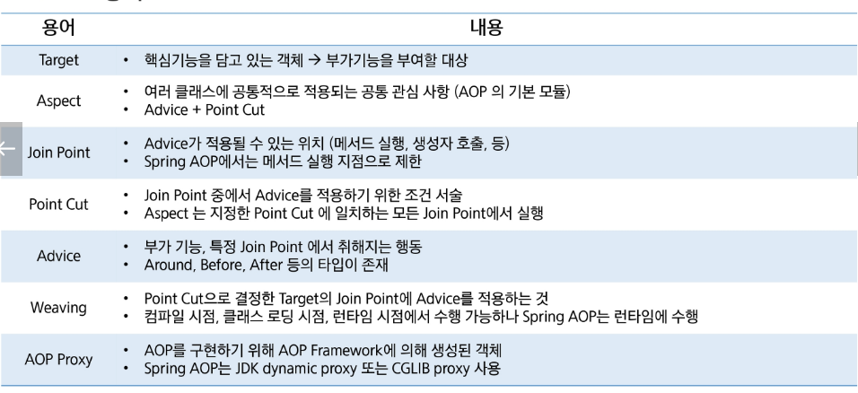
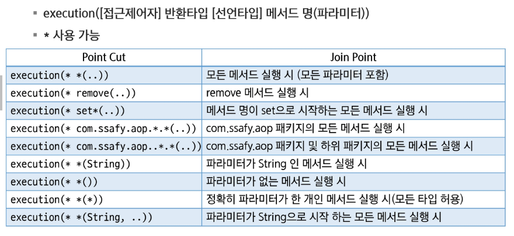
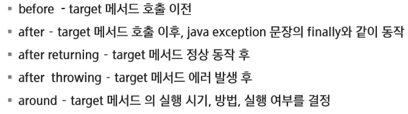
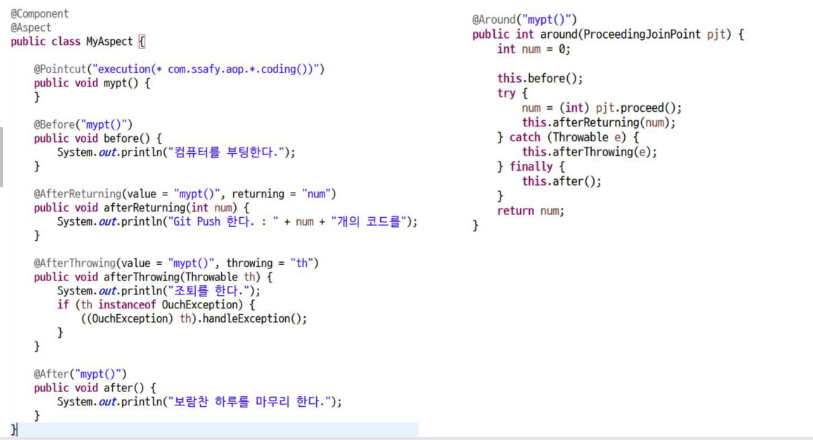

# Spring

## AOP

### 관점 지향 프로그래밍

#### AOP

- 어플리케이션 로직에는 핵심 기능과 부가 기능이 존재
- 핵심 기능: 객체가 제공하는 고유의 기능
- 부가 기능: 핵심 기능을 보조하기 위한 기능(시간 측정, 로그 추적, 트랜잭션 관리 등)

- OOP에서 모듈화의 핵심 단위는 클래스인 반면, AOP에서 모듈화의 단위는 Aspect
- Aspect는 여러 타입과 객체에 거쳐서 사용되는 기능 (Cross-Cutting, 트랜잭션 관리 등)의 모듈화
- AOP는 OOP를 대체하는 것이 아닌 보조하는 목적

#### AOP 용어

#### Point Cut 표현식

---

### Proxy

#### 프록시

- 대리인
- 프록시 서버는 클라이언트가 자신을 통해서 다른 네트워크 서비스에 간접적으로 접솔할 수 있게 해주는 컴퓨터 시스템이나 응용 프로그램을 가리킨다
- 접근 제어와 부가 기능 추가를 수행할 수 있다.

---

### Spring AOP

#### Advice Type

#### Spring AOP Proxy

- 실제 기능이 구현된 Target 객체를 호출하면, target이 호출되는 것이 아니라 advice가 적용된 Proxy 객체가 호출됨
- Spring AOP는 기본값으로 표준 JDK dynamic proxy를 사용
- 인터페이스를 구현한 클래스가 아닌 경우 CGLIB 프록시를 사용

