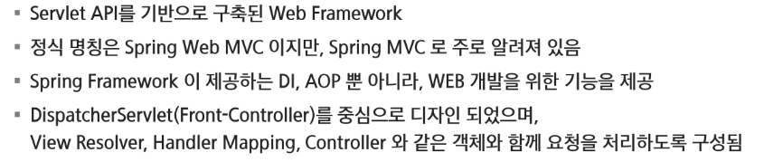
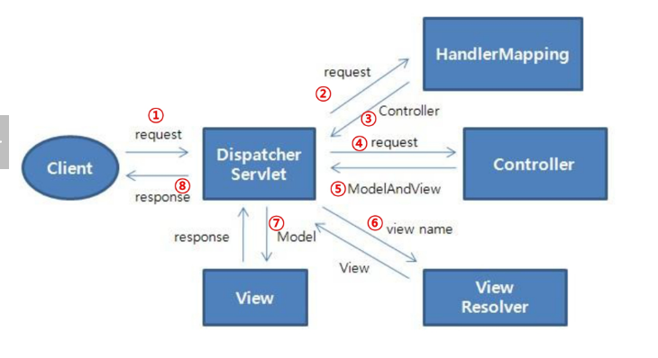
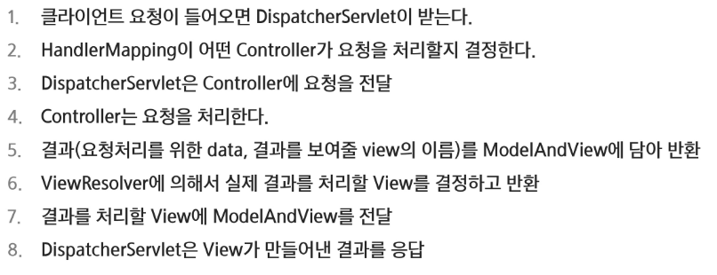

# Spring

## MVC

### MVC 패턴

#### Model

- 동작을 수행하는 코드
- 사용자 View에 어떻게 보일지에 대해서 신경 x
- 데이터 질의에 대한 정보를 재공하는 기능 및 데이터에 대한 수정을 담당

#### View

- 사용자가 화면에 무엇을 어떻게 볼 것인지를 결정
- 사용자 화면에 보이는 부분
- 모델의 정보를 받아와 사용자에게 보여주는 역할 수행
- 자체적으로 모델의 정보를 보관 x

#### Controller

- 요청을 받아 검증하고 비즈니스 로직을 수행
- 모델과 뷰를 연결하는 역할을 수행
- 사용자에게 데이터를 가져오고 수정하고 제공함

---

### Spring Web MVC

#### Spring MVC 구성요소

- DispatcherServlet -> 클라이언트 요청처리 (요청 및 처리 결과 전달)
- HandlerMapping -> 요청을 어떤 Controller가 처리할지 결정
- Controller -> 요청에 따라 수행할 메서드를 선언하고, 요청 처리를 위한 로직 수행(비즈니스 로직 호출)
- ModelAndView -> 요청처리를 하기 위해서 필요한 혹은 그 결과를 저장하기 위한 객체
- ViewResolver -> Controller에 선언돤 View 이름을 기반으로 결과를 반환할 View를 결정
- View -> 응답화면 생성

#### 요청 처리 흐름

