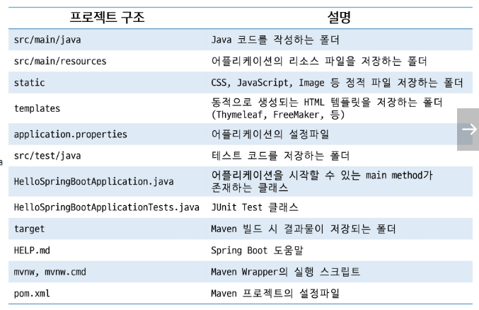

# Spring

## Spring Boot

### Spring Boot의 등장

- 스프링을 더욱 편리하게 사용할 수 있게 만들어줌
- 호환이 가능한 라이브러리에 대한 버전을 가지고 있음
- "Just run" 할 수 있는 독립형, 프로덕션 등급의 스프링 기반의 어플리케이션을 쉽게 생성할 수 있음

#### Spring Boot 특징

- 독립 실행형 스프링 어플리케이션 생성
- Tomcat을 내장하고 있어 WAR 파일을 배포할 필요가 없음
- 'starter' 종속성을 제공하여 빌드 구성을 단순화함
- 스프링, 3rd 파티 라이브러리의 버전을 자동으로 관리
- 상태 확인 기능 제공
- XML에 대한 요구사항 없음

#### Spring Boot Project 구조

