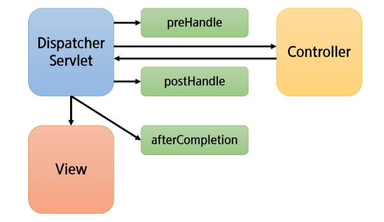

# Spring

## Filter & Interceptor

### Listener & Filter

#### Listener란?

- 프로그래밍에서 Listener란 특정 이벤트가 발생하기를 기다리다가 실행되는 객체
- 이벤트란 특정한 사건 발생
- 서블릿 컨테이너에서 발생하는 이벤트 감지
- web.xml 파일에 `<listener>` 태그를 이용하여 사용 가능
- 리스너가 여러 개일 경우 보통 선언된 순서대로 실행되지만 아닌 경우가 있으므로 각가그이 리스너는 독립적으로 동작할 숫 있도록 설계하는 것이 좋음

#### Filter

- 요청과 응답 데이터를 필터링하여 제어, 변경하는 역할
- 사용자의 요청이 Servlet에 전달되어지기 전에 Filter를 거침
- Servlet으로부터 응답이 사용자에게 전달되어지기 전에 Filter를 거침
- FilterChain을 통해 연쇄적으로 동작 가능

---

### Interceptor

- HandlerIntercepter를 구현한 것
- 요청을 처리하는 과정에서 요청을 가로채서 처리
- 접근 제어, 로그 등 비즈니스 로직과 구분되는 반복적이고 부수적인 로직 처리

#### PreHandle

#### postHandle

#### afterCompletion

#### Intercepter 흐름

