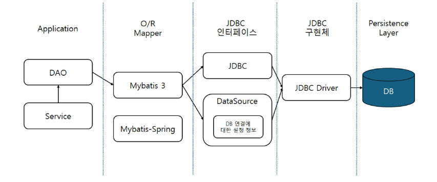
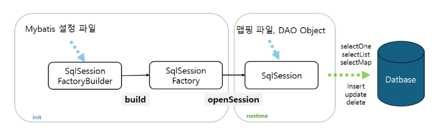
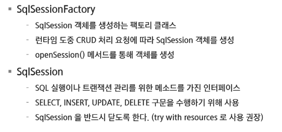
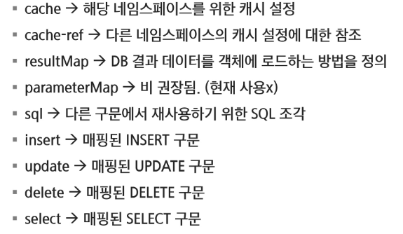

# Spring

## MyBatis

### MyBatis

- SQL 매핑 프레임워크
- SQL문과 저장 프로시저 등의 매핑을 지원하는 퍼시스턴스 프레임워크
- JDBC로 처리하는 상당부분의 코드와 파라미터 설정 및 결과 처리를 대신해줌
- Map 인터페이스 그리고 자바 POJO를 설정 데이터베이스와 매핑해서 사용할 수 있음
- XML과 Annotation 설정을 통해 사용할 수 있음

#### MyBatis 구성 요소

- MyBatis는 SqlSession 인터페이스를 통해 DB와 상호작용을 한다.

#### MyBatis-설정하기(typeAliases)

- 타입 별칭은 자바 타입에 대한 짧은 이름, XML 설정에서만 사용
- 클랮스 단위 or 패키지 단위로 등록할 수 있음
- 이름을 지정하지 않으면 소문자로 바뀐 형태의 값이 지정됨
- 공통 자바 타입을 위한 여러 내장 타입 별칭이 존재
- 오버로딩 된 이름 때문에 원시형 타입은 특별 취급

#### MyBatis-설정하기(mppers)

- 매핑된 SQL 구문 설정파일의 위치 작성
- class path의 상대경로의 리소스 사용
- 절대경로의 url 사용
- mapper 인터페이스 사용
- 매퍼 패키지 내의 모든 인터페이스를 등록

#### Mapper XML 파일

