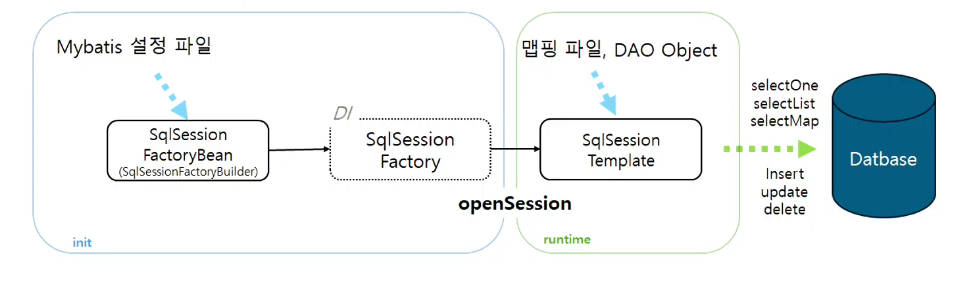

# Spring
## MyBatis+Spring

- 마이바티스-스프링 연동 모듈은 둘을 간편하게 연동하도록 도와준다.
- 해당 모듈은 마이바티스로 하여금 스프링 트랜잭션에 쉽게 연동되도록 처리한다.
- mapper와 SqlSession을 다루고, 빈에 주입시켜준다.
- MyBatis 예외를 스프링의 DataAccessException으로 반환한다.

#### MyBatis-Spring 구성요소

- SqlSessionfactoryBean
- SqlSessionTemplet