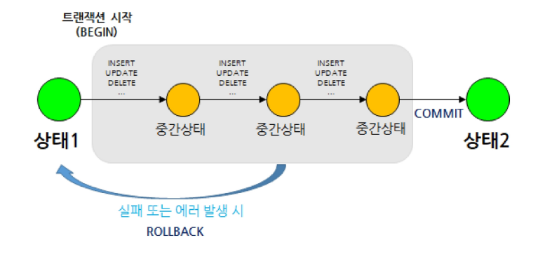

# Spring

## MyBaits 동적쿼리

### Dynamic SQL

#### 동적 SQL

- Rumtime 시점에서 생성되는 SQL
- 사용자의 입력 혹은 특정 조건에 따라 동적으로 SQL을 생성하여 실행하는 방식
- Mybatis를 활동하면 동적 SQL을 보다 편리하게 사용할 수 있음
- JSTL이나 XML 기반의 텍스트 프로세서와 비슷한 느낌

#### 동적 SQL 사용하는 이유

- 유연성 -> 실행 중 SQL 쿼리를 조건에 따라 동적으로 생성할 수 있음. 다양한 상황에 따른 SQL 실행
- 조건부 -> 사용자가 선택한 조건에 따라 WHEHE 절 추가할 수 있음
- 정렬 -> 동적으로 정렬 조건을 추가할 수 있음

<보안 문제와 SQL Injection 공격에 노출될 수 있음>

#### MyBatis 동적 SQL 종류

- if
- choose
- trim
- foreach

#### 동적 SQL 예시

---

### Spring TX

#### Transaction

- 데이터베이스의 상태를 변화시키기 위해 수행하는 논리적인 작업의 단위
- 원자성: 트랜잭션의 작업은 모두 수행되거나, 전혀 수행되지 않아야 한다.
- 일관성: 트랜잭션은 데이터베이스를 일관성 있는 상태로 유지해야 한다.
- 격리성: 동사에 실행되는 트랜잭션들이 서로 영향을 미치지 않아야 한다.
- 지속성: 트랜잭션이 성공적으로 완료되면, 그 결과는 영구적으로 반영되어야 한다.

#### Transaction 동작방식

#### Spring TX

- Spring에서 제공하는 트랙잭션 기능을 활용할 수 있음
- @Transactional을 활용하여 트랜잭션을 적용할 메서드를 선언한다.
- 해당 어노테이션이 있다면 자동으로 트랜잭션을 시작하고, 정상 종료 시 commit, 오류 발생 시 rollback 수행

#### Spring TX 동작과정

- 트랜잭션 관리자를 통해 수행
- @Transactional을 사용하면 Spring AOP를 통해 AOP 프록시 객체를 생성하고 이 프록시 객체가 관리자에게 처리를 위임한다.
- 따라서 사용자가 직접 관리할 필요없이 선언만으로 트랜잭션을 관리할 수 있다.
  
