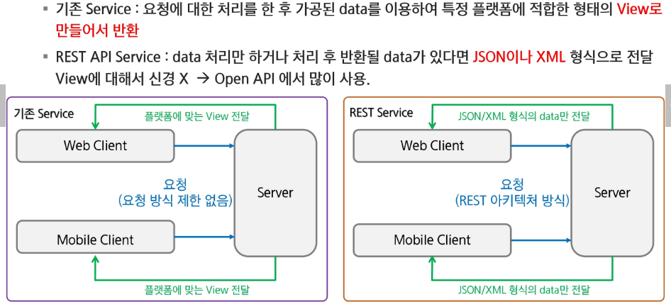

# Spring

## REST API

#### Rest

- 2000년 로이 필딩의 박사학위 논문에 최초로 소개
- 웹의 장점을 최대한 활용할 수 있는 아키텍처로 REST 발표
- Representational State Transfer의 약어
- HTTP 프로토콜을 사용하여 데이터를 주고 받는 방법
- HTTP URI를 통해 제어할 자원을 명시하고, HTTP Method를 통해 해당 자원을 제어하는 명령을 내리는 방식의 아키텍처

#### REST 구성

- 자원 -> URI
- HTTP 메서드 -> 작업에 대한 정의 (C / R / U / D)
- 표현 -> Client와 Server 간 자원의 상태를 전달하는 방법으로 JSON, XML 등의 형식을 사용한다.

---

#### API

- Application Programming Interface
- 다른 소프트웨어 어플리케이션에서 사용할 수 있는 기능을 제공하는 인터페이스
- 어플리케이션 간 데이터를 교환하고 상호 작용하도록 도움을 줌
- (예: 미세먼지 정보 제공 시스템)

#### API 유형

- Private API

  - 비공개 API
  - 내부 시스템 또는 서비스 간의 통신을 위해 사용되는 API로 외부에 공개되지 않음
  - 주로 기업 내부 시스템에서의 통신을 위해 사용

- Public API

  - 공개 API
  - 외부 사용자 혹은 외부 어플레케이션과 상호작용하기 위해 공개된 API
  - 사용에 대한 권한 설정과 비용이 있을 수도 있음
  - 대부분 REST 방식

#### REST API

- 기존의 전송방식과는 달리 서버는 요청으로 받은 리소스에 대해 순수한 데이터를 전송
- 기존의 GET/POST 외에 PUT/DELETE 방식을 사용하여 리소스에 대한 CRUD 처리 가능
- HTTP URI를 통해 제어할 자원을 명시하고 HTTP method(GET/POST/PUT/DELETE)를 통해 해당 자원을 제어하는 명령을 내리는 방식의 아키텍처

#### API URI 설계

#### RESTful

- REST 아키텍처 스타일을 따르는 웹 서비스를 설계하고 구현하는 방식
- 플랫폼 독립성
- 높은 성능
- 간결함가 명확성
- 표준화된 통신

---

### Spring REST API

#### Spring REST 관련 Annotation / Class

#### @ResponseBody

- Controler 메서드가 HTTP 응답의 본문을 직접 반환함을 나타내는 Annotation

#### Jackson Databind

- Jackson 라이브러리의 일부
- Java 객체와 JSON 데이터 간의 변환을 담당
- 별도의 Anotation 없이 자동으로 JSON 데이터를 매핑할 수 있음

#### @RESTController

- Spirng MVC에서 RESTful 서비스를 개발할 때 주로 사용함
- 해당 Annotaiton을 활용하면 모든 메서드가 @ResponseBody를 포함하게 됨
- 따라서 반환객체가 HTTP 응답 본문에 작성되며, JSON 또는 XML 등의 형태로 전송 가능
- @Controller + @ResponseBody

##### @PathVariable

- URI의 일부를 변소로 가져와 메서드의 매개변수로 전달할 때 사용
- RESTful 웹 서비스에서 경로 변수를 처리하는데 사용

#### @RequestBody

- HTTP 요청의 본문에 포함되어 있는 데이터를 Java 객체로 변환할 때 사용
- RESTful 웹 서비스에서 Client가 전송한 데이터를 서버에서 받아서 처리하는데 사용
- form-data로 요청 전송 시 @ModelAttribute를 사용하여 처리
- JSON 형태의 요청 전송시 @RequestBody를 사용하여 처리
