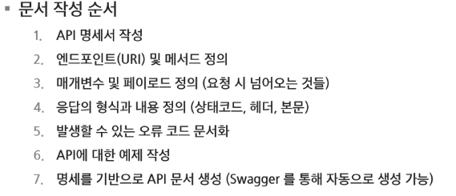
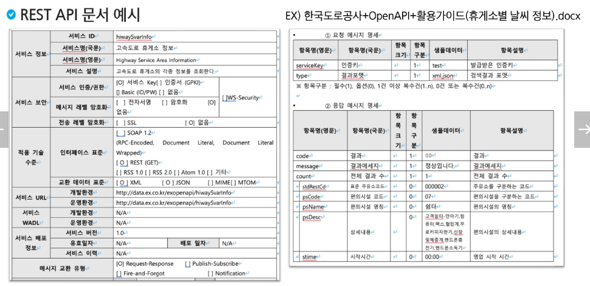
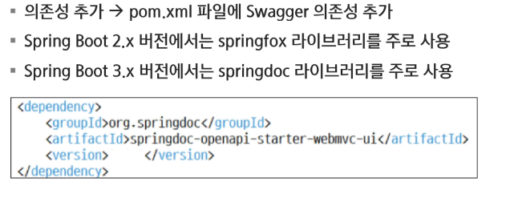
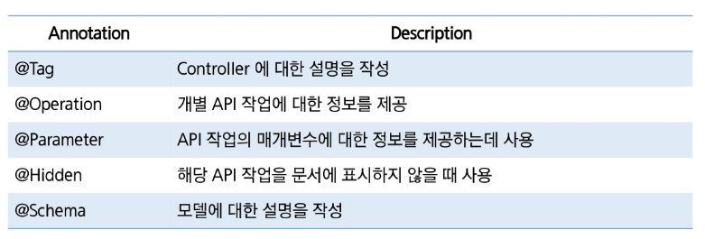

# Spring

## REST API 실습

### Swagger

#### REST API 문서화

- API의 사용법과 기능을 설명하는 문서를 작업하는 가정
- 문서화가 잘 되어있다면 API에 대한 이해도를 높이고, 개발 생산성을 높일 수 있음
  

#### REST API 문서 예시

#### Swagger 특징

- 시각적 표현 -> API를 직관적으로 이해할 수 있도록 Swagger UI를 지원하여 시각적으로 API를 표현하는 기능을 제공하고, 이를 통해 개발자들이 API의 구조와 작동 방식을 쉽게 파악할 수 있음
- 실시간 테스트
- 문서 자동화 -> API 문서를 자동으로 생성하고 업데이트 하는 기능을 제공

#### Swagger 사용

#### Swagger 문서화 Annotation

