# Front

## Javascript 기본문법

### Javascript

#### 자바스크립트란?

- 웹 페이지에 동작을 넣어주는 프로그래밍 언어
- 웹 브라우저에서 주로 사용, Node.js를 이용하여 콘솔 환경에서 사용
- 자바와 기본 구문이 비슷하다

---

### 기본 문법

#### 변수

- var
- let
- const
  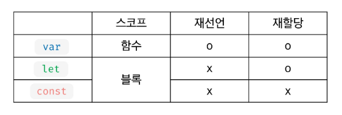

#### undefined

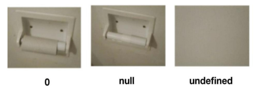

#### 데이터 타입

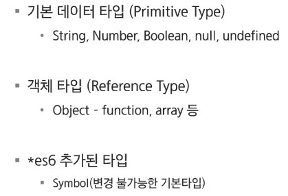

#### 자바스크립트 false

- null
- undefined
- 0
- '' (빈 문자열)
- NaN

#### 일치 연산자

- 값과 타입이 일치하는지 체크
- ===, !==

#### 배열

- 배열의 생성: [], Array() 활용
- 배열의 크기는 동적으로 변경된다
- 크기가 지정되어 있지 않은 경우에도 데이터의 입력 가능
- 배열은 여러가지의 데이터 타입을 하나의 배열에 입력할 수 있음
  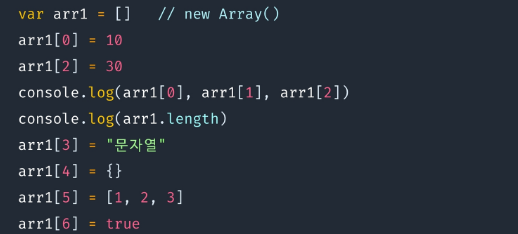
- 함수를 이용하여 데이터 추가 가능
  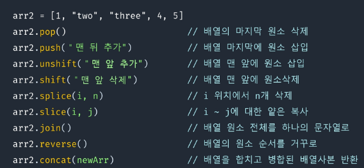

---

### 반복문

#### for of

- 배열에서 요소를 하나씩 순회하며 반복하는 반복문
- 꺼내지는 모든 요소는 블럭 내에서 변수로 선언되기 때문에 변수 선언 키워드 작성 필수
  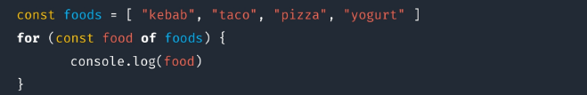

#### for in

- Object -> Key || Array -> index를 순회하는 반복문
  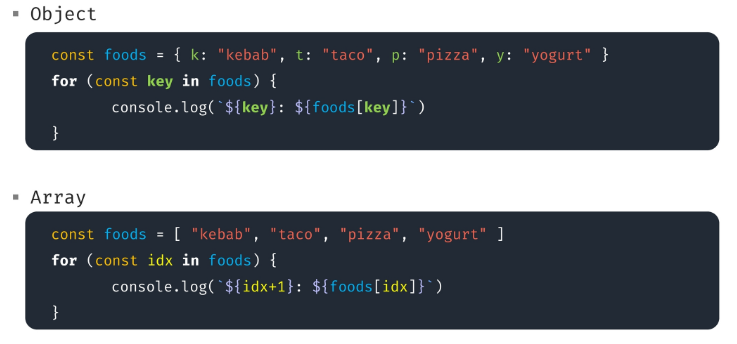

---

### 객체

#### 객체(Object)

- 객체는 문자열로 이름을 붙인 값들의 집합체
- 객체에 저장하는 값을 프로퍼티라고 함
- 객체는 prototype이라는 특별한 프로퍼티를 가지고 있음

#### 객체 만들기

- 객체 리터럴 이영: {}
- Object 생성자 이용: new Object()
- 생성자 함수 이용
  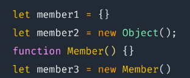

#### 객체 프로퍼티

- 생성자 함수를 사용해서 property 추가 가능 & this 키워드 사용 가능
  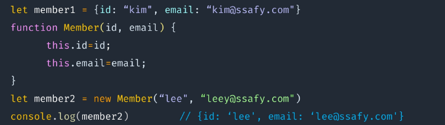
- .(dot) 또는 []를 이용하여 프로퍼티의 조회 및 변경을 처리
  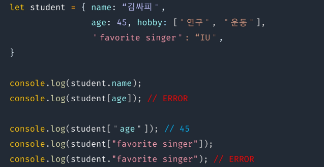
  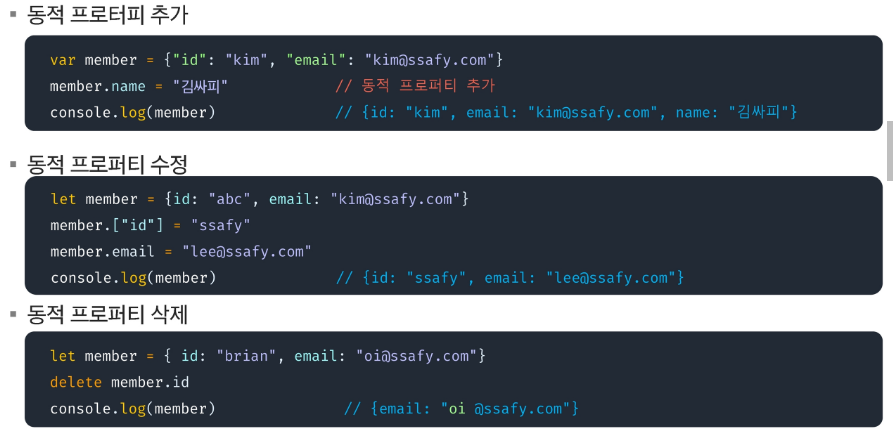
- 객체 변수에는 주소가 저장도디어 공유 가능
  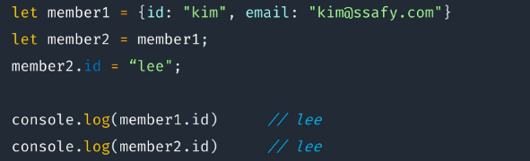
- 함수 안에서의 this는 함수를 호출한 객체
  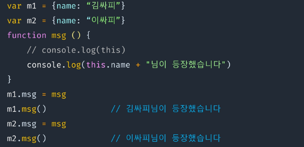
