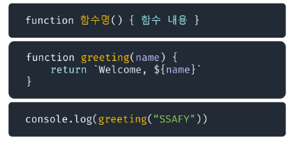
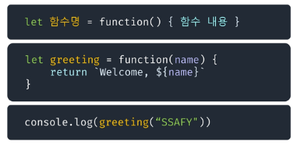
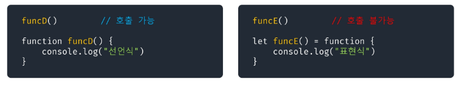
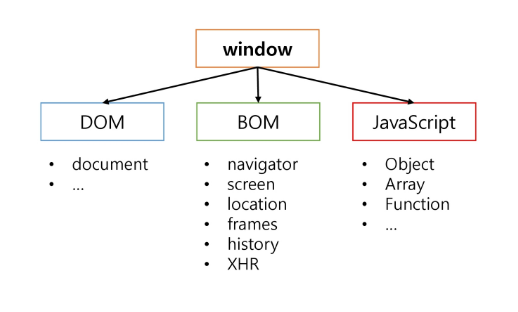

# Front

## 함수 & DOM

### 함수

#### 함수(Function)

- 자바스크립트에서 함수는 객체 타입으로 값처럼 사용이 가능
- 함수를 변수에 대입하거나 매개변수로 넘길 수 있음
- 배열의 요소에 넣거나 객체의 프로퍼티로 설정이 가능
- 매개변수의 개수가 일치하지 않아도 호출이 가능
- JavaScript의 함수는 일급객체에 해당
- `fuction` 키워드 사용
- 함수의 블럭은 중괄호 사용
- 선언식, 표현식

#### 함수 선언식

- 일반적인 프로그래밍 언어의 함수 정의 방식
- 함수의 이름과 함께 정의하는 방식
- 함수의 이름
- 매개 변수
- 내용
- 호이스팅 됨

#### 함수 표현식

- 익명함수로 정의 가능
- 매개 변수
- 내용

#### 선언식 vs 표현식

- 선언식 함수는 호이스팅의 영향을 받아 함수 선언 이전에 호출이 가능
- 표현식 함수는 선언 이전에 호출이 불가능

#### 화살표 함수

1. `fuction` 키워드 생략 가능
2. 함수의 매개변수가 오직 한 개라면 ()도 생략 가능
3. 함수의 내용이 한 줄이라면 {}와 return도 생략 가능
4. 인자가 없다면, `()` || `_` 으로 표시 가능

---

### DOM

- XML, HTML 문서의 각 항목을 계층으로 표현하여 생성, 변형, 삭제할 수 있도록 돕는 인터페이스
- DOM은 문서 요소 집합을 트리 형태의 계층 구조로 HTML 표현

#### getElementById

- id의 이름으로 첫번쨰 요소를 반환
- 존재하지 않는 id 값인 경우 null을 반환

#### querySelector

- #id, .class, tag, [property] 활용해서 첫번째 요소를 반환
