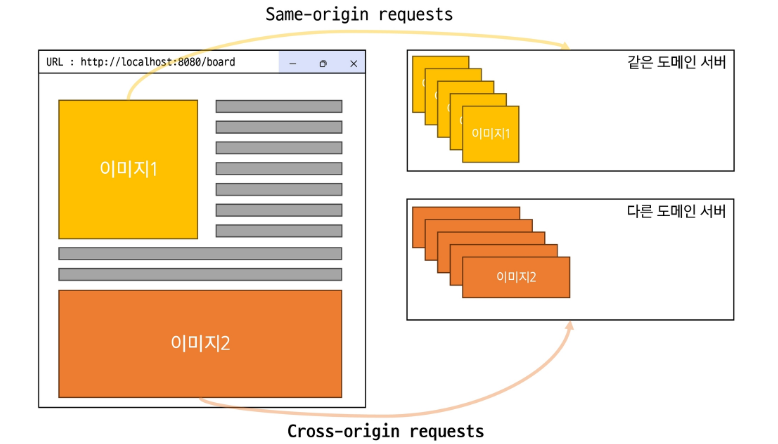
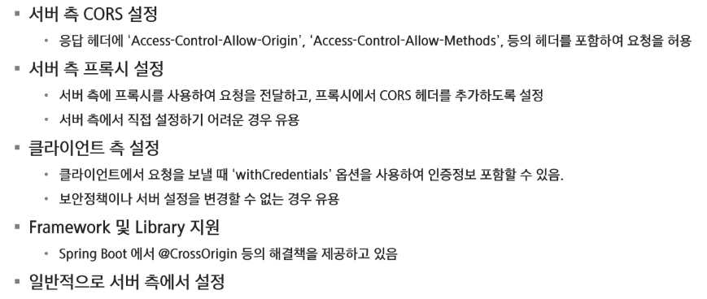

# Spring

## CORS

### CORS

#### 동일 출처 정책

- 웹 보안 모델 중 하나로 웹 브라우저가 스크립트로 생성된 요청이 다른 출처로부터 리소스에 접근하는 것을 방지함
- 웹 어플리케이션의 안전성을 보호하고 CSRF, XSS와 같은 웹 공격을 방지하는 역할
- 브라우저에서 기본적으로 사용하는 정책
- 출처는 프로토콜, 호스트, 포트로 구성

#### 자원 접근

#### 교차 출처 리소스 공유

- 추가 HTTP 헤더를 사용하여, 한 출처에서 실행중인 웹 어플리케이션이 다른 출처의 선택한 자원에 접근할 수 있는 권한을 부여하도록 브라우저에 알려주는 채제
- 웹 어플리케이션은 리소스가 자신의 출처와 다를 떄 교차 출처 HTTP 요청을 실행한다
- 다른 출처의 리소스를 불러올려면 그 출처에서 올바른 CORS 헤더를 포함한 응답을 반환해야 함

#### CORS 해결

- 서버 측 CORS 설정
- 서버 측 프록시 설정
- 클라이언트 측 설정
- Framework 및 Library 지원
- 일반적으로 서버 측에서 설정
  
